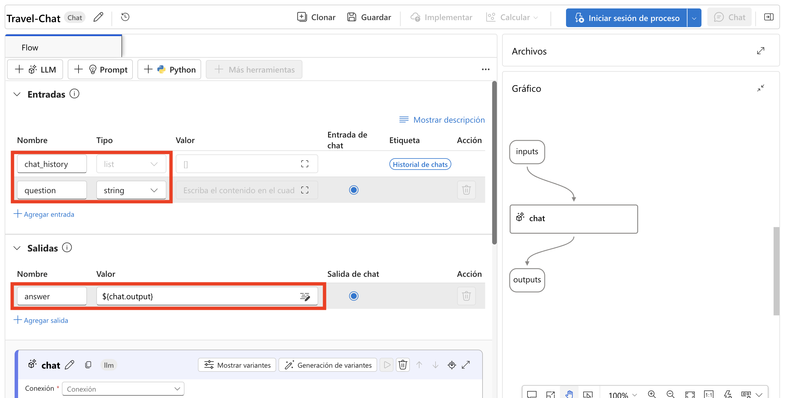

# Ejercicio 5: Implementación de un flujo de chat e integración de herramientas

> **Nota**: Debido a la alta demanda, es posible que la cuota de AML Compute no esté disponible para algunos usuarios, lo que podría impedir la ejecución de ciertos pasos del laboratorio en este ejercicio. Sin embargo, esto no afectará su progreso en el laboratorio. Puede leer los pasos, comprender el ejercicio y luego ejecutar la validación actualizada; el progreso se seguirá registrando. Gracias por su comprensión.

## Descripción del laboratorio
En este laboratorio, diseñarás e implementarás un flujo de chat para interactuar con un modelo de lenguaje desplegado. Comenzarás creando un flujo de chat básico usando Azure AI foundry, que incluye la integración de entradas, un nodo LLM y la configuración de la salida para reflejar las respuestas del chat. Luego probarás el flujo de chat, asegurarás que funcione correctamente y lo desplegarás en un entorno de producción. Los pasos finales implican verificar el despliegue, probar el flujo desplegado con consultas de ejemplo y explorar opciones para integrar el flujo de chat en aplicaciones como un copiloto personalizado.

## Objetivos del laboratorio
En este laboratorio, realizarás lo siguiente:
- Tarea 1: Diseñar e implementar un flujo de chat
- Tarea 2: Usar LLM y herramientas de prompt en flujos

## Tarea 1: Diseñar e implementar un flujo de chat
Diseña e implementa un flujo de chat usando Azure AI foundry para interactuar con un modelo de lenguaje desplegado, prueba su funcionalidad y despliega para uso en producción.

1. Desde el menú de navegación izquierdo, bajo **My assets**, selecciona **Model + endpoints (1)**.

2. En la página **Manage deployments of your models, apps, and services**, bajo la pestaña **Model deployments**, selecciona **+ Deploy model (2)** y luego selecciona **Deploy base model (3)** del menú desplegable.

   

3. En la página **Select a model**, busca **gpt-35-turbo (1)**, selecciona **gpt-35-turbo (2)** y luego selecciona **Confirm (3)** bajo **gpt-35-turbo**.

   

4. En **Deploy model gpt-35-turbo** ingresa el nombre del despliegue: **gpt-35-turbo** y haz clic en **Customize**.

5. En **Deploy model gpt-35-turbo**, sigue estas instrucciones para crear la implementación y haz clic en **Deploy (5)**:
   
   - Deployment Name: **gpt-35-turbo (1)**
   - Deployment type: **Standard (2)**
   - Model version: **0125 (Default) (3)**
   - Tokens per Minute Rate Limit (thousands): **10K (4)**

        
     
6. Regresa a **Model + endpoints**. En la página de **Model + deployments**, selecciona **gpt-35-turbo (1)** y haz clic en **Open in playground (2)**.

     

7. En la ventana de chat, ingresa la consulta **What can you do?**.

   >**Nota:** La respuesta será genérica porque no hay instrucciones específicas para el asistente. Para enfocarlo en una tarea, puedes cambiar el system prompt.
   > Espera 5 minutos si recibes un error al consultar.
   
     

>**Nota:** La salida será diferente; no será exactamente igual. Sin embargo, se parecerá a la captura de pantalla.

8. Actualiza lo siguiente en la sección **Give the model instructions and context (1)** bajo la pestaña **Setup**:

   ```
   **Objective**: Assist users with travel-related inquiries, offering tips, advice, and recommendations as a knowledgeable travel agent.

   **Capabilities**:
   - Provide up-to-date travel information, including destinations, accommodations, transportation, and local attractions.
   - Offer personalized travel suggestions based on user preferences, budget, and travel dates.
   - Share tips on packing, safety, and navigating travel disruptions.
   - Help with itinerary planning, including optimal routes and must-see landmarks.
   - Answer common travel questions and provide solutions to potential travel issues.
    
   **Instructions**:
   1. Engage with the user in a friendly and professional manner, as a travel agent would.
   2. Use available resources to provide accurate and relevant travel information.
   3. Tailor responses to the user's specific travel needs and interests.
   4. Ensure recommendations are practical and consider the user's safety and comfort.
   5. Encourage the user to ask follow-up questions for further assistance.

   ```
   
9. Selecciona **Apply changes (2)**.

     

10. Haz clic en **Continue**.

11. En la ventana de chat, ingresa la misma consulta que antes: **What can you do?**. Observa el cambio en la respuesta.

     

     > **Nota:** La salida será diferente; no será exactamente igual. Sin embargo, se parecerá a la captura de pantalla.

12. Desde el panel de navegación izquierdo, selecciona **Prompt flow (1) > + Create (2)** para agregar la herramienta Prompt a tu flujo.

     

13. En la ventana **Create a new flow**, bajo **Chat flow**, haz clic en **Create**, luego ingresa **Travel-Chat** como nombre de carpeta y haz clic en **Create**.

     

14. Se crea un flujo de chat simple para ti. Observa que hay dos entradas (**chat history y la pregunta del usuario**), un nodo LLM que se conectará con tu modelo de lenguaje desplegado y una salida para reflejar la respuesta en el chat.

     

15. Para poder probar tu flujo, necesitas cómputo. Selecciona **Start compute session** desde la barra superior.

     
   
      >**Nota:** La sesión de cómputo tomará de 1 a 3 minutos en iniciar.
   
16. Selecciona el nodo LLM llamado **chat**. Reemplaza el prompt existente con el siguiente prompt:

      ```
      system:
      **Objective**: Assist users with travel-related inquiries, offering tips, advice, and recommendations as a knowledgeable travel agent.
      
      **Capabilities**:
      - Provide up-to-date travel information, including destinations, accommodations, transportation, and local attractions.
      - Offer personalized travel suggestions based on user preferences, budget, and travel dates.
      - Share tips on packing, safety, and navigating travel disruptions.
      - Help with itinerary planning, including optimal routes and must-see landmarks.
      - Answer common travel questions and provide solutions to potential travel issues.
      
      **Instructions**:
      1. Engage with the user in a friendly and professional manner, as a travel agent would.
      2. Use available resources to provide accurate and relevant travel information.
      3. Tailor responses to the user's specific travel needs and interests.
      4. Ensure recommendations are practical and consider the user's safety and comfort.
      5. Encourage the user to ask follow-up questions for further assistance.
      
      
      user:
      {{item.inputs.question}}
      assistant:
      {{item.outputs.answer}}
      
      
      user:
      {{question}}
      ```

     

17. Selecciona **Save**.

18. Aún necesitas conectar el nodo LLM con tu modelo desplegado. En la sección **LLM node**:

    - **Connection**: Selecciona **my-ai-service{suffix}_aoai (1)**
    - **Deployment_name**: Selecciona el modelo **gpt-35-turbo (2)** que desplegaste.
    - **response_format**: Selecciona **{“type”:”text”} (3)**.

       
   
## Tarea 2: Usar LLM y herramientas de prompt en flujos

Ahora que has desarrollado el flujo, puedes usar la ventana de chat para probarlo.

1. Asegúrate de que la sesión de cómputo esté activa. Selecciona **Save (1)**. Selecciona **Chat (2)** para probar el flujo.

     

1. Ingresa la consulta: **I have one day in London, what should I do?** y revisa la salida.

     

      >**Nota:** La salida será diferente; no será exactamente igual. Sin embargo, se parecerá a la captura de pantalla.

1. Selecciona **Deploy** para desplegar el flujo con la siguiente configuración:

     
   
     - Configuración básica:
        - Endpoint: **New (1)**
        - Endpoint name: **modelendpoint-{suffix} (2)**
        - Deployment name: **modeldeploy-{suffix} (3)**
        - Virtual machine: **Standard_DS3_v2 (4)**
        - Instance count: **3 (5)**
        - Inferencing data collection: **Enabled (6)**
        - Selecciona **Review + Create (7)**

         

1. Selecciona **Create**    

1. En Azure AI foundry, desde el panel de navegación izquierdo, bajo **My assets**, selecciona **Model + endpoints**

   >**Nota:** Selecciona **Save** si tu flujo no está guardado.

1. Selecciona la pestaña **Model deployments (1)** para encontrar tu flujo desplegado. Puede tomar algo de tiempo antes de que el despliegue aparezca y se cree exitosamente. Cuando el despliegue haya finalizado, selecciona el nuevo despliegue **(2)**.

     

1. Espera hasta que el **Provisioning state** sea **Succeeded (1)**, solo entonces tendrás la pestaña **Test (2)** disponible.

     

1. Navega a la pestaña **Test**, ingresa el prompt **What is there to do in San Francisco?** y revisa la respuesta.

     

     >**Nota:** La salida será diferente; no será exactamente igual. Sin embargo, se parecerá a la captura de pantalla.

1. Ingresa el prompt **Where else could I go?** y revisa la respuesta.

     

     >**Nota:** La salida será diferente; no será exactamente igual. Sin embargo, se parecerá a la captura de pantalla.

1. Visualiza la página **Consume** del endpoint y observa que contiene información de conexión y código de ejemplo que puedes usar para construir una aplicación cliente para tu endpoint, permitiéndote integrar la solución de prompt flow en una aplicación como un copiloto personalizado.

     

## Revisión
En este laboratorio has completado las siguientes tareas:
- Diseñaste e implementaste un flujo de chat
- Usaste LLM y herramientas de prompt en flujos

### Has completado exitosamente el laboratorio. Haz clic en **Next >>** para continuar con el siguiente ejercicio.
