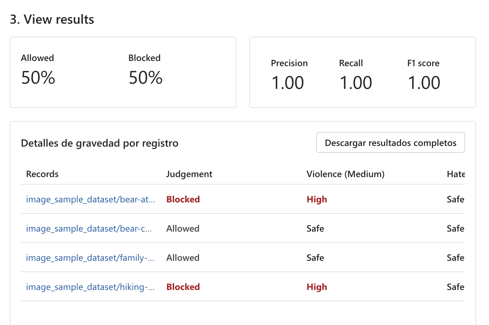
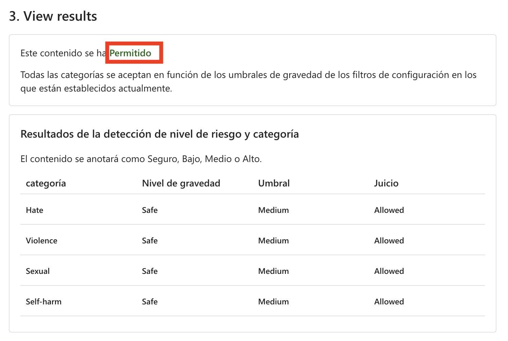

# Ejercicio 6: Garantizando Prácticas de IA Responsable con Content Safety

## Descripción del laboratorio
Este laboratorio proporciona experiencia práctica en la implementación de prácticas de IA responsable utilizando Azure AI Foundry. Los participantes obtendrán conocimientos sobre equidad, transparencia, privacidad y consideraciones de seguridad mientras aprovechan las herramientas integradas de Responsible AI de Azure. El laboratorio se enfoca en detectar y mitigar sesgos, asegurar la interpretabilidad del modelo, aplicar técnicas de preservación de la privacidad y aplicar las mejores prácticas de seguridad y cumplimiento.

## Objetivos del laboratorio
En este laboratorio, realizarás lo siguiente:

- Tarea 1: Moderación de imágenes y texto usando Azure AI foundry

## Tarea 1.1: Moderación de imágenes y texto usando Azure AI Foundry

Esta tarea implica usar **Azure AI Foundry** para moderar imágenes y texto detectando contenido inapropiado, dañino o sensible. Se aprovechan modelos de IA para analizar y filtrar contenido según políticas predefinidas, asegurando el cumplimiento y la seguridad en las aplicaciones.

1. En el portal de **Azure AI Foundry**, selecciona **Guardrails + Controls (1)** bajo **Protect and govern**, luego selecciona **Try it Out (2)**. En la opción **Filter image content**, selecciona **Moderate image content (3)**.

    

1. En **Moderate image content**, selecciona la pestaña **Run a simple test** y revisa las opciones que aparecen debajo.
   
#### Safe content

1. Antes de comenzar, selecciona los servicios de Azure AI que aparecen abajo y continúa el laboratorio usando estos servicios.

     

1. Ahora usemos nuestra imagen de prueba y revisemos el resultado. En la pestaña **Run a simple test**, selecciona **Safe content (1)** y haz clic en **Browse for a file (2)**

     

1. Dentro del **explorador de archivos**, navega a **C:\LabFiles\Day-4-Developing-AI-App-with-Azure-AI-Foundry\Developing-AI-Applications-with-Azure-AI-Studio-main\Labs\data\image_sample_dataset (1)**, presiona **Enter**, luego selecciona **family-builds-campfire.jpg (2)** y haz clic en **Open**.

     

1. Revisa la imagen y haz clic en **Run test**.

    
   
1. Revisa el resultado. Como se esperaba, el contenido de esta imagen es **Allowed** y el nivel de severidad es Safe en todas las categorías. 

    

    >**Nota**: Hasta ahora, hemos probado contenido de imagen de manera individual. Sin embargo, si tuviéramos un conjunto de datos masivo de imágenes, podríamos probarlo todo de una vez y recibir métricas basadas en el desempeño del modelo.

#### Self harmed content

También debemos anticipar que los clientes puedan subir contenido de imagen dañino. Para asegurarnos de contemplar este escenario, probemos la detección de contenido dañino.

1. Selecciona **Self harmed content (1)** y haz clic en **Browse for a file (2)**.

    

1. Dentro de **file explorer** navega a `C:\LabFiles\Day-4-Developing-AI-App-with-Azure-AI-Foundry\Developing-AI-Applications-with-Azure-AI-Studio-main\Labs\data\image_sample_dataset` y luego sube el archivo **bear-attack-blood.JPG**.

1. Configura todos los niveles de Threshold en **Medium**.

1. Selecciona **Run test**.

    > **Nota**: Correctamente, el contenido es Blocked y fue rechazado por el filtro de Violence, que tiene un nivel de severidad High.

### Tarea 1.2: Ejecutar una prueba masiva

Hasta ahora, hemos probado contenido de imagen de manera individual. Sin embargo, si tuviéramos un conjunto de datos masivo de imágenes, podríamos probarlo todo de una vez y recibir métricas basadas en el desempeño del modelo.

1. En **Moderate image content** selecciona la pestaña **Run a bulk test (1)** y haz clic en **Browse for a file (2)**.

     .png)

1. Dentro del explorador de archivos, navega a **C:\LabFiles\Day-4-Developing-AI-App-with-Azure-AI-Foundry\Developing-AI-Applications-with-Azure-AI-Studio-main\Labs\data**, presiona **Enter**. Selecciona la carpeta **image_sample_dataset.zip (1)** y haz clic en **Open (2)**.

    
   
1. Bajo la sección Test, revisa **Dataset preview (1)**, luego selecciona la pestaña **Configure filters** y revisa **Category** y **Threshold level** **(2)**, después haz clic en **Run test (3)**.

     

1. Revisa el **resultado**.

   

   

### Tarea 1.3: Moderación de texto usando Moderate text content

Podemos aprovechar un modelo de IA para detectar si el texto ingresado por los clientes es dañino y luego usar los resultados de la detección para implementar las precauciones necesarias.

#### Safe content

Primero probemos comentarios positivos de clientes.

1. Regresa al portal de **Azure AI Foundry**, selecciona **Guardrails + Controls (1)**, haz clic en **Try it out (2)** y selecciona **Moderate text content (3)**.

     

1. En la página **Moderate text content**, selecciona **Run a simple test (1)** y elige **Safe content (2)** bajo la sección **select a sample or type your own**.

   

1. En el **Test box**, ingresa lo siguiente:

     - **I recently used the PowerBurner Camping Stove on my camping trip, and I must say, it was fantastic! It was easy to use, and the heat control was impressive. Great product! (1)**

     - Configura todos los niveles de Threshold en **Medium (2)**.

     - Selecciona **Run test (3)**.

       
     
1. Revisa el resultado.

    

    >**Nota**: El contenido es **Allowed** y el nivel de severidad es Safe en todas las categorías. Esto era de esperarse dado el sentimiento positivo y no dañino del comentario del cliente.

#### Harmful content

¿Pero qué pasaría si probamos una declaración dañina? Probemos con un comentario negativo de cliente. Aunque está bien no gustar de un producto, no queremos permitir insultos o declaraciones degradantes.

1. En el **Test box**, ingresa lo siguiente:

    - **I recently bought a tent, and I have to say, I'm really disappointed. The tent poles seem flimsy, and the zippers are constantly getting stuck. It's not what I expected from a high-end tent. You all suck and are a sorry excuse for a brand**. **(1)**

    - Configura todos los niveles de Threshold en **Medium (2)**.

    - Selecciona **Run test (3)**.

      
 
   - Aunque el contenido es **Allowed**, el nivel de severidad para Hate es bajo. Para guiar a nuestro modelo a bloquear este tipo de contenido, deberíamos ajustar el nivel de Threshold para **Hate**. Un nivel de Threshold más bajo bloquearía cualquier contenido con severidad baja, media o alta. ¡No hay lugar para excepciones!

   - Configura el nivel de Threshold para **Hate** en `Low` (2).

   - Selecciona **Run test (3)**.

     
    
   - Ahora el contenido es **Blocked** y fue rechazado por el filtro en la categoría Hate.

      

#### Violent content with misspelling

No podemos anticipar que todo el contenido de texto de los clientes esté libre de errores ortográficos. Afortunadamente, la herramienta Moderate text content puede detectar contenido dañino incluso si tiene errores de ortografía. Probemos esta capacidad con otro comentario de cliente sobre un incidente con un mapache.

1. Selecciona **Violent content with misspelling**.

    

1. En el **Test box**, ingresa lo siguiente:

    - **I recently purchased a campin cooker, but we had an accident. A racon got inside, was shocked, and died. Its blood is all over the interior. How do I clean the cooker?**

    - Configura todos los niveles de Threshold en **Medium**.

    - Selecciona **Run test**.

    - Aunque el contenido es Allowed, el nivel de severidad para Violence debería ser Low. Podrías ajustar el nivel de Threshold para Violence para intentar bloquear este contenido, pero ¿deberíamos hacerlo? Considera un escenario donde el cliente hace esta pregunta en una conversación con el agente de soporte al cliente impulsado por IA con la esperanza de recibir orientación sobre cómo limpiar el equipo. Puede que no haya mala intención, por lo que podría ser mejor no bloquear este contenido. Como desarrollador, considera varios escenarios donde este contenido podría ser aceptable antes de decidir ajustar el filtro y bloquear contenido similar.
  
#### Ejecutar una prueba masiva
Hasta ahora, hemos probado contenido de imagen de manera individual. Sin embargo, si tuviéramos un conjunto de datos masivo de imágenes, podríamos probarlo todo de una vez y recibir métricas basadas en el desempeño del modelo.

Tenemos un conjunto de datos masivo de imágenes proporcionadas por clientes. El conjunto también incluye imágenes dañinas de ejemplo para probar la capacidad del modelo de detectar contenido dañino. Cada registro en el conjunto incluye una etiqueta para indicar si el contenido es dañino. ¡Hagamos otra ronda de pruebas pero ahora con el conjunto de datos!

1. Cambia a la pestaña **Run a bulk test (1)**. Selecciona **Browse for a file (2)**.

    

1. Dentro de **file explorer** navega a **C:\LabFiles\Day-4-Developing-AI-App-with-Azure-AI-Foundry\Developing-AI-Applications-with-Azure-AI-Studio-main\Labs\data** y presiona **Enter**. Selecciona el archivo **bulk-image-moderation-dataset.csv (2)** y **Open (2)**.
   
    > Nota: El nombre del archivo CSV puede variar.
   
     
     
1. En la sección **Dataset preview (1)**, revisa los registros y su etiqueta correspondiente. Un 0 indica que el contenido es aceptable (no dañino). Un 1 indica que el contenido es inaceptable (contenido dañino). **(2)**

     - Configura todos los niveles de Threshold en **Medium (3)**.

     - Selecciona **Run test (4)**.
   
       

1. Revisa el resultado.

    

    

## Revisión
En este laboratorio has completado las siguientes tareas:
- Moderación de imágenes: Probaste imágenes individuales y masivas para seguridad, autolesiones y contenido generado por IA.
- Moderación de texto: Analizaste texto seguro y dañino, incluyendo errores ortográficos, con pruebas masivas.
- Conclusión: Azure AI Content Safety mejora la moderación de contenido para el cumplimiento y espacios digitales más seguros.

### Has completado exitosamente el laboratorio.
