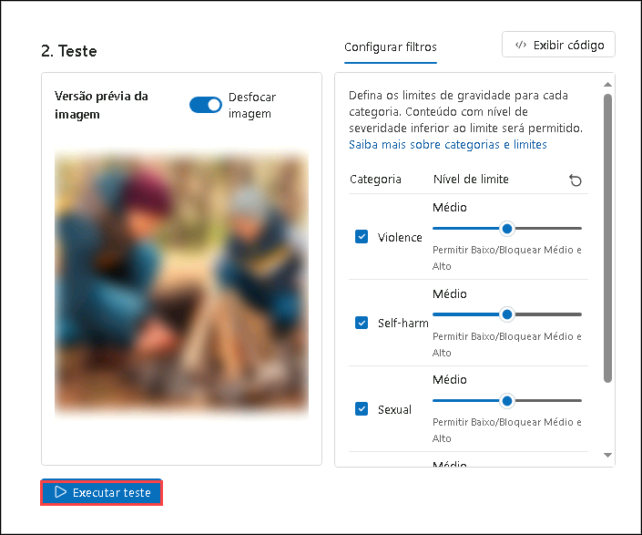
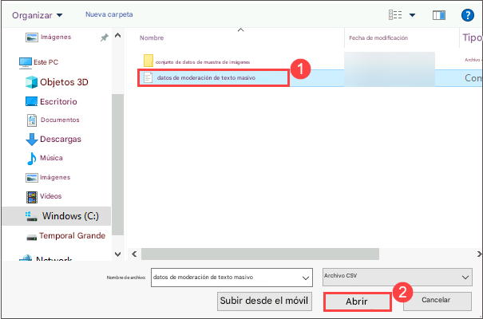

# Exercício 6: Garantindo Práticas Responsáveis de IA com Content Safety

## Visão Geral do Laboratório

Este laboratório oferece uma experiência prática na implementação de práticas responsáveis de IA usando o Azure AI Foundry. Os participantes aprenderão sobre considerações de justiça, transparência, privacidade e segurança ao utilizar as ferramentas integradas de IA Responsável do Azure. O laboratório se concentra na detecção e mitigação de vieses, garantindo a interpretabilidade do modelo, aplicando técnicas que preservam a privacidade e reforçando as melhores práticas de segurança e conformidade.

**Objetivos do laboratório**

Neste laboratório, você executará o seguinte:

- Tarefa 1: Atribuir à sua conta a função de Usuário dos Serviços
  Cognitivos

- Tarefa 2: Moderação de imagem e texto usando o Azure AI Foundry

### Tarefa 1: Atribuir à sua conta a função de Usuário dos Serviços Cognitivos

1.  No portal do Azure +++, encontre seu recurso chamado
    [***my-ai-service@lab.LabInstance.Id***](mailto:my-ai-service@lab.LabInstance.Id).

2.  Selecione **Access Control (IAM)**.

3.  Escolha **Add\>Add Role Assignment**.

   

4.  Em **Job function roles**, busque e selecione +++Cognitive Services
    User+++, em seguida, selecione **Next**.

   

5.  Selecione **+Select members**.

6.  Pesquise e selecione
    [*+++user1-@lab.LabInstance.Id*](mailto:+++user1-@lab.LabInstance.Id)+++.

   

7.  Selecione **Review + assign**.

8.  Talvez seja necessário aguardar de 3 a 5 minutos para que a nova
    função entre em vigor antes de prosseguir com a próxima tarefa.

## Tarefa 2.1: Moderação de Imagens e Textos Usando o Azure AI Foundry

Esta tarefa envolve o uso do **Azure AI Foundry** para moderar imagens e textos, detectando conteúdos inapropriados, prejudiciais ou sensíveis. Ela utiliza modelos de IA para analisar e filtrar conteúdo com base em políticas pré-definidas, garantindo conformidade e segurança nas aplicações.

1. No portal **Azure AI Foundry**, selecione **Safety + Security (1)** em **Assess and Improve** e depois clique em **Try it Out (2)**. Em **Filter image content**, selecione **Moderate image content**.

   

2. Em **Moderate image content**, selecione a aba **Run a simple test (1)** e observe que temos três tipos de conteúdo definidos: **Safe content**, **self-harm content** e **AI-generated sexual content (2)**.

   

### Conteúdo Seguro

1. Antes de iniciar, selecione os serviços do Azure AI mostrados abaixo e prossiga com o laboratório utilizando esses serviços.

    

    

    
2. Agora vamos usar nossa imagem para teste. Na aba **Run a simple test**, selecione **Safe content (1)** e clique em **Browse for a file (2)**.

   

3. No **explorador de arquivos**, vá até **C:\LabFiles\Day-4-Developing-AI-App-with-Azure-AI-Foundry\Model-Evaluation-and-Model-Tunning\Labs\data\image_sample_dataset (1)**, pressione **Enter**, selecione o arquivo **family-builds-campfire.jpg (2)** e clique em **Open (3)**.

   

4. Revise a imagem e clique em **Run test**.

   

5. Revise o resultado. Como esperado, o conteúdo da imagem está **Permitido**, e o nível de severidade é **Seguro** em todas as categorias.

   

   > **Nota**: Até agora, testamos imagens individualmente. No entanto, se tivermos um conjunto maior de imagens, podemos testá-lo de uma vez só e obter métricas com base no desempenho do modelo.

### Conteúdo de Autolesão

Devemos antecipar que clientes possam postar conteúdo prejudicial. Para lidar com isso, vamos testar a detecção de imagens com conteúdo de autolesão.

1. Selecione **Self harmed content (1)** e clique em **Browse for a file (2)**.

   

2. No **explorador de arquivos**, navegue até **C:\LabFiles\Day-4-Developing-AI-App-with-Azure-AI-Foundry\Model-Evaluation-and-Model-Tunning\Labs\data\image_sample_dataset** e envie o arquivo **bear-attack-blood.JPG**.

3. Defina todos os níveis de **Threshold** como **Médio**.

4. Clique em **Run test**.

   > **Nota**: Como esperado, o conteúdo foi **Bloqueado** e rejeitado pelo filtro de **Violência**, com nível de severidade **Alto**.


### Tarefa 2.2: Executar Teste em Lote

Até agora, testamos o conteúdo de imagem com imagens isoladas e individuais. No entanto, se tivermos um conjunto de dados com várias imagens, podemos testá-lo de uma só vez e obter métricas com base no desempenho do modelo.

1. Em **Moderate image content**, selecione a aba **Run a bulk test (1)** e clique em **Browse for a file (2)**.

   

2. No explorador de arquivos, vá para **C:\LabFiles\Day-4-Developing-AI-App-with-Azure-AI-Foundry\Model-Evaluation-and-Model-Tunning\Labs\data**, pressione **Enter**, selecione o arquivo **image_sample_dataset.zip (1)** e clique em **Open (2)**.

   

3. Na página de Test, revise a **Dataset preview (1)**, selecione a aba **Configure filters**, revise a **Categoria** e o **Threshold level (2)**, e clique em **Run test (3)**.

   

4. Revise os **resultados**.

   


   

### Tarefa 2.3: Moderação de Texto com Moderate Text Content

Podemos usar um modelo de IA para detectar se o texto enviado por clientes é prejudicial e aplicar as precauções necessárias.

#### Conteúdo Seguro

Vamos testar um feedback positivo de cliente.

1. No portal **Azure AI Foundry**, em **Safety + Security (1)**, selecione **Moderate text content**.

   

2. Em **Moderate text content**, clique em **Run a simple test (1)** e escolha **Safe content (2)** na seção **select a sample or type your own**.

   

3. No **campo de teste**, insira:

   - **I recently used the PowerBurner Camping Stove on my camping trip, and I must say, it was fantastic! It was easy to use, and the heat control was impressive. Great product! (1)**

   - Defina os níveis de **Threshold** como **Médio (2)**.

   - Clique em **Run test (3)**.

     

4. Revise o resultado.

   

   > **Nota**: O conteúdo está **Permitido**, e o nível de severidade é **Seguro** em todas as categorias. Isso era esperado, dado o sentimento positivo e inofensivo do feedback do cliente.


#### Conteúdo Prejudicial

Mas o que aconteceria se testássemos uma declaração prejudicial? Vamos testar com um feedback negativo de um cliente. Embora não haja problema em não gostar de um produto, não queremos tolerar xingamentos ou declarações ofensivas.

1. No **campo de teste**, insira:

    - **I recently bought a tent, and I have to say, I'm really disappointed. The tent poles seem flimsy, and the zippers are constantly getting stuck. It's not what I expected from a high-end tent. You all suck and are a sorry excuse for a brand**. **(1)**

   - Defina os níveis de Threshold como **Médio (2)**.

   - Clique em **Run test (3)**.

     

   - Embora o conteúdo esteja **Permitido**, o nível de Severidade para **Ódio** é baixo. Para orientar nosso modelo a bloquear esse tipo de conteúdo, precisaríamos ajustar o Nível de Limite (Threshold) para **Ódio**. Um limite mais baixo bloquearia qualquer conteúdo com severidade baixa, média ou alta. Não há espaço para exceções!

   - Defina o **Threshold de Hate** para **Baixo (2)**.

   - Clique em **Run test (3)** novamente.

     

   - O conteúdo agora está **Bloqueado**, rejeitado pelo filtro na categoria **Hate**.

     

#### Conteúdo Violento com Erros Ortográficos

Não podemos presumir que todo o conteúdo de texto dos nossos clientes estará livre de erros ortográficos. Felizmente, a ferramenta de moderação de conteúdo de texto consegue detectar conteúdo nocivo mesmo quando há erros de ortografia. Vamos testar essa capacidade em outro feedback de cliente sobre um incidente com um guaxinim.

1. Selecione **Violent content with misspelling**.

   !

2. Insira o seguinte:

   ```
   I recently purchased a campin cooker, but we had an accident. A racon got inside, was shocked, and died. Its blood is all over the interior. How do I clean the cooker?
   ```

   * Defina os níveis de **Threshold** como **Médio**.

   * Clique em **Run test**.

   > Embora o conteúdo esteja Permitido, o nível de Severidade para Violência deveria ser Baixo. Você poderia ajustar o Nível de Limite (Threshold) para Violência a fim de tentar bloquear esse tipo de conteúdo, mas será que devemos? Considere um cenário em que o cliente está fazendo essa pergunta em uma conversa com o agente de atendimento ao cliente com IA, na esperança de receber orientações sobre como limpar o fogão. Pode não haver má intenção ao enviar essa pergunta e, por isso, pode ser melhor não bloquear esse tipo de conteúdo. Como desenvolvedor, leve em conta diferentes cenários em que esse conteúdo pode ser aceitável antes de decidir ajustar o filtro e bloquear conteúdos semelhantes.


#### Executar um teste em lote
Até agora, testamos o conteúdo de imagem com imagens isoladas. No entanto, se tivermos um conjunto de dados em lote com várias imagens, podemos testá-lo de uma vez só e receber métricas com base no desempenho do modelo.

Temos um conjunto de dados em lote com imagens fornecidas por clientes. Esse conjunto também inclui imagens prejudiciais de exemplo para testar a capacidade do modelo de detectar conteúdo nocivo. Cada registro no conjunto de dados inclui um rótulo indicando se o conteúdo é prejudicial ou não. Vamos fazer mais uma rodada de testes, mas desta vez com o conjunto de dados completo!

1. Vá até a aba **Run a bulk test (1)** e clique em **Browse for a file (2)**.

   

2. No explorador de arquivos, vá para **C:\LabFiles\Day-4-Developing-AI-App-with-Azure-AI-Foundry\Model-Evaluation-and-Model-Tunning\Labs\data**, selecione **bulk-image-moderation-dataset.csv (2)** e clique em **Open (2)**.

   

   > **Nota**: O nome do arquivo CSV pode variar.

3. Em **Dataset preview section (1)**, navegue pelos registros e veja os rótulos. Um valor 0 indica conteúdo aceitável, e 1 indica conteúdo prejudicial. **(2)**

   * Defina todos os níveis de **Threshold** como **Médio (3)**.

   * Clique em **Run test (4)**.

     

4. Revise os resultados.

   

   

## Revisão

Neste laboratório, você completou as seguintes tarefas:

- Moderação de Imagens: Testou imagens individuais e em lote para segurança, autolesão e conteúdo gerado por IA.
- Moderação de Texto: Analisou textos seguros e prejudiciais, incluindo erros ortográficos, com testes em lote.
- Conclusão: O Content Safety do Azure AI melhora a moderação de conteúdo, promovendo ambientes digitais mais seguros e em conformidade.


### Você concluiu com sucesso o laboratório. 
