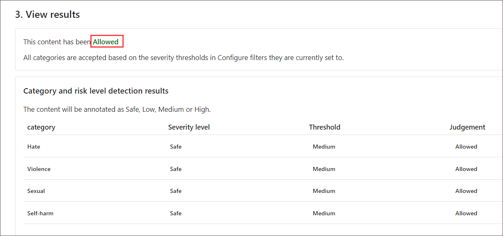
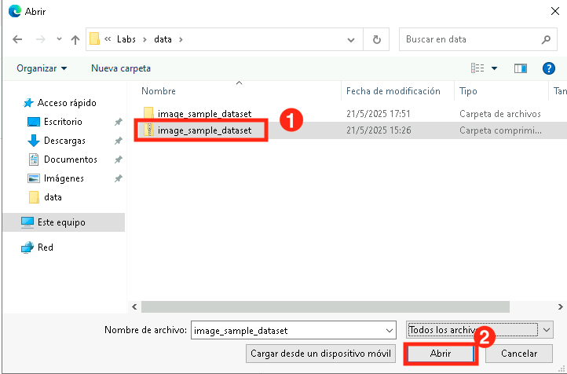
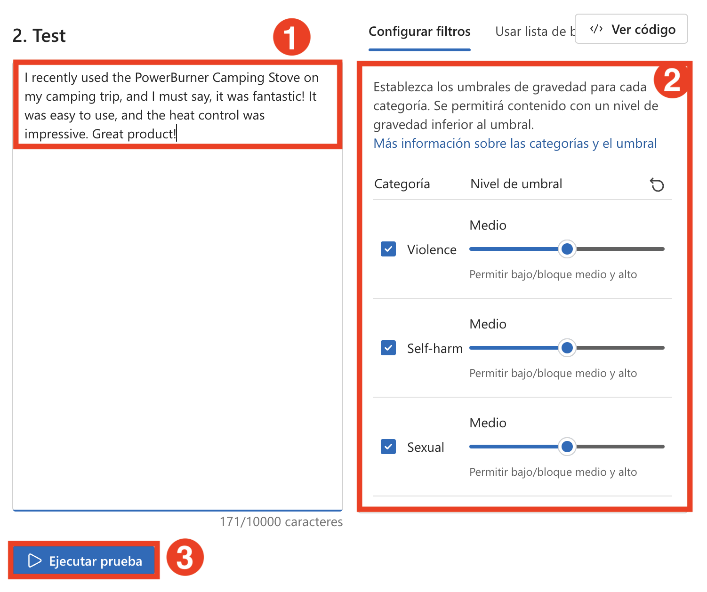
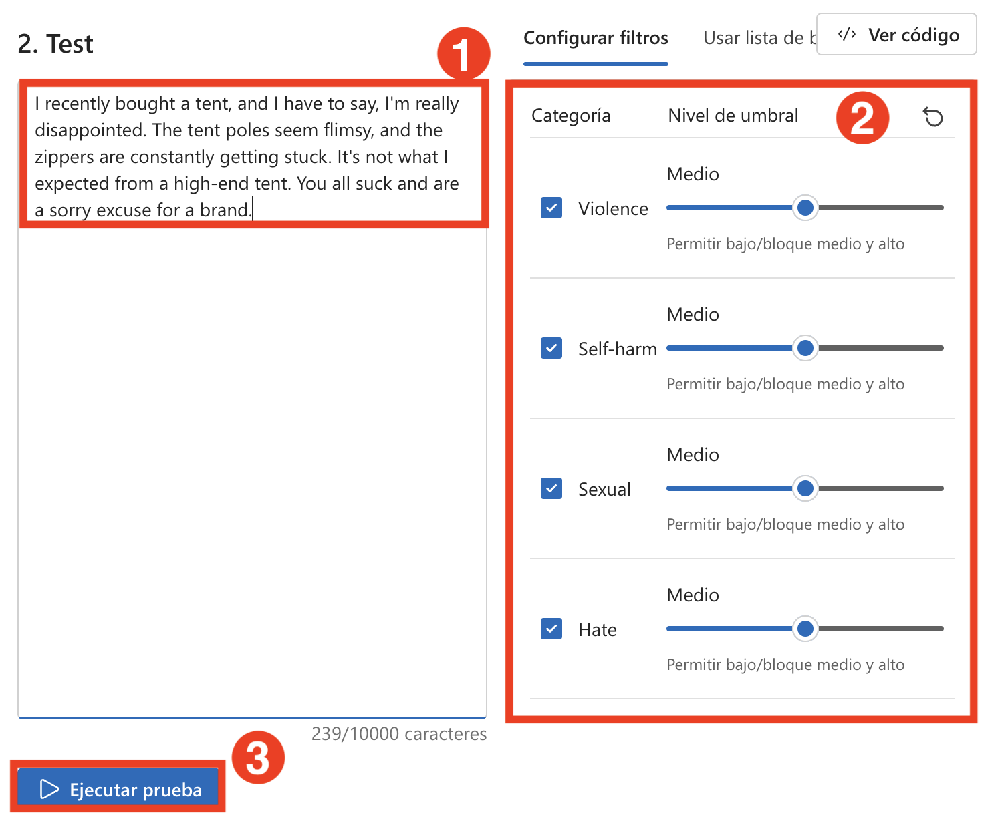
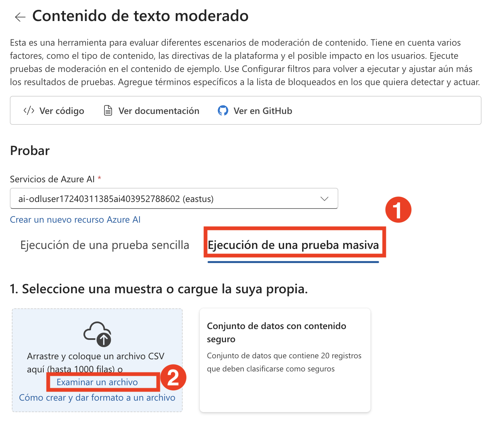
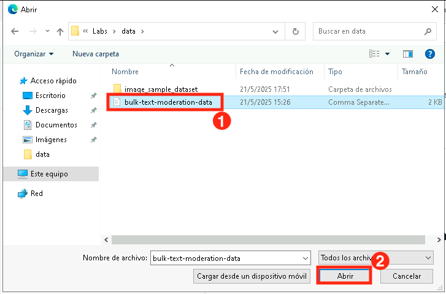
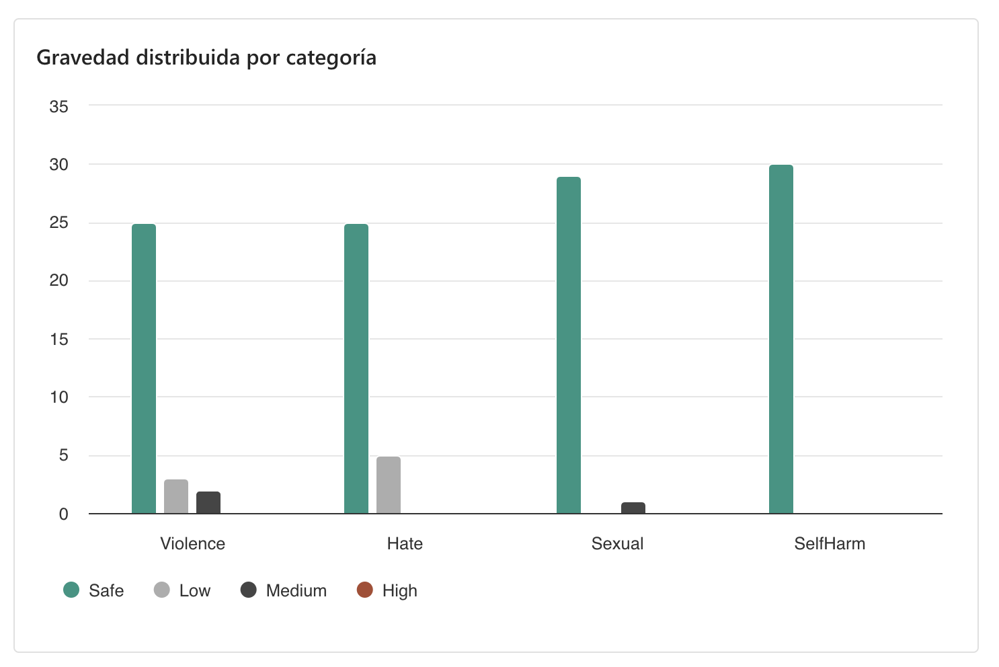

# 練習 6：透過內容安全 (Content Safety) 確保負責任的 AI (Responsible AI) 實踐

## 實驗概覽

本實驗將透過 Azure AI Foundry 提供實驗經驗，協助你實踐負責任的 AI 的最佳做法。參與者將深入了解公平性、透明性、隱私與安全等考量，同時運用 Azure 內建的負責任的 AI 工具。本實驗著重於偵測與減緩偏誤、確保模型可解釋性、應用保護隱私的技術，以及強化安全性與合規性的最佳實務。

**實驗室目標**

在本練習中，您將執行以下作:

- 任務 1: 為帳戶分配認知服務用戶角色

- 任務 2 : 使用 Azure AI Foundry 進行圖像和文本審核

### 任務1: 為帳戶分配認知服務用戶角色

1.  在Azure portal
    +++[https://portal.azure.com+++](https://portal.azure.com+++/),
    查找名為 [**my-ai-service@lab.LabInstance.Id**](mailto:my-ai-service@lab.LabInstance.Id).

2.  選擇 **Access Control (IAM)**.

3.  選擇 **Add\>Add Role Assignment**.

    

4.  在“工作職能角色”下, 搜索並選擇 +++Cognitive Services User+++,
    然後選擇 **Next**.

    

5.  選擇 **+Select members**.

6.  搜索並選擇<+++user1-@lab.LabInstance.Id>+++.

    

7.  選擇 **Review + assign**.

8.  您可能需要等待 3-5
    分鐘才能讓新角色生效，然後才能繼續執行下一個任務。

## 任務 2.1：使用 Azure AI Foundry 進行圖片與文字的內容審查

本任務將使用 **Azure AI Foundry** 來審查圖片與文字，偵測不當、有害或敏感內容。這項功能利用 AI 模型根據預先定義的政策分析並過濾內容，確保應用程式的合規性與安全性。

1. 在 **Azure AI Foundry** 入口網站中，於 **保護和控管** 下選擇 **護欄 + 控制項** **(1)**，然後點選 **試用看看** **(2)**。

          

2. 在 **篩選影像內容** 選項下，選擇 **中等影像內容**。

     

3. 在 **中等影像內容** 頁面中，選擇 **執行簡單測定** **(1)** 分頁，檢視選項，注意我們有三種預設內容類型： **安全內容 (Safe content)**、 **自殘內容 (Self-harm content)** 和 **AI 產生的色情內容 (AI-generated sexual content)** **(2)**。

     

#### 安全內容（Safe content）

1. 在開始之前，請選擇下方的 Azure AI 服務，並使用這些服務繼續進行實驗。

     

2. 現在我們來使用圖片進行測試並檢查結果。在 **執行簡單測定** 分頁中，選擇 **安全內容 (1)**，然後點選 **瀏覽檔案 (2)**。

     

3. 在 **檔案總管** 中，前往 **C:\LabFiles\Day-4-Developing-AI-App-with-Azure-AI-Foundry\Model-Evaluation-and-Model-Tunning\Labs\data\image_sample_dataset** **(1)**，按下 **Enter**，然後選擇 **family-builds-campfire.jpg** **(2)**，點選 **Open** **(3)**。

     

4. 檢視圖片後，點選 **執行測試**。

    
   
5. 檢視結果。如預期，這張圖片的內容為 **Allowed**，且在所有分類中的嚴重程度皆為 Safe。

    

   >**注意**： 目前我們測試的是單張圖片內容。不過，如果我們有一批圖片資料集，也可以一次性測試整批資料，並根據模型的表現取得相關指標。

#### 自殘內容（Self harmed content）

我們也應預期使用者可能會上傳有害的圖片內容。為了因應這種情況，我們來測試偵測有害圖片內容的功能。

1. 選擇 **自殘內容** **(1)**，然後點選 **瀏覽檔案** **(2)**。

    

2. 在 **檔案總管** 中，前往 `C:\LabFiles\Day-4-Developing-AI-App-with-Azure-AI-Foundry\Model-Evaluation-and-Model-Tunning\Labs\data\image_sample_dataset`，然後上傳 **bear-attack-blood.JPG** 檔案。

3. 將所有閾值層級設為 **中**。

4. 選擇 **執行測試**。

    >**注意**： 如預期，該內容被已封鎖 (Blocked)，並被暴力過濾器 (Violence filter) 拒絕，該分類的嚴重程度為高 (High)。

### 任務 2.2：執行批次測試

到目前為止，我們測試的都是單張圖片內容。不過，如果我們有一批圖片資料集，也可以一次性測試整批資料，並根據模型的表現取得相關指標。

1. 在 **中等影像內容** 頁面中，選擇 **執行大量測試** **(1)** 分頁，然後點選 **瀏覽檔案** **(2)**。

     .png)

2. 在**檔案總管**中，前往 **C:\LabFiles\Day-4-Developing-AI-App-with-Azure-AI-Foundry\Model-Evaluation-and-Model-Tunning\Labs\data**，按下 **Enter**。選取 **image_sample_dataset.zip** **(1)** 資料夾，然後點選  **Open** **(2)**。

    
   
3. 在 Test 區段中，檢視 **資料集預覽** **(1)**，然後選擇 **設定篩選** 分頁，檢查 **類別** 與 **閾值層級** **(2)** ，接著點選 **執行測試** **(3)**。

     

4. 檢視測試結果。

   

   

### 任務 2.3：使用中等文字內容進行文字審查

我們可以利用 AI 模型來偵測客戶輸入的文字是否具有傷害性，並根據偵測結果採取必要的預防措施。

#### 安全內容（Safe content）

我們先來測試一些正面的客戶回饋。

1. 在 **Azure AI Foundry** 入口網站中，於 **保護和控管** 下選擇 **護欄 + 控制項** **(1)**，選擇 **中等文字內容**。

   

2. 在 **中等文字內容** 頁面中，選擇 **執行簡單測定** **(1)**，然後在 **選取範例或輸入自己的範例** 區段中選擇 **安全內容** **(2)**。

   

3. 在 **Test** 區段中輸入以下內容：

     - **我最近在露營旅行中使用了 PowerBurner 露營爐，我必須說，它真的很棒！它操作簡單，而且火力控制也令人印象深刻。是一款很棒的產品！** **(1)**

     - 將所有閾值層級設為 **中** **(2)**。

     - 選擇 **執行測試** **(3)**。

       
     
4. 檢視結果。

    

    >**注意**： 此內容為 **Allowed**，且所有分類的嚴重程度皆為 Safe。這是預期中的結果，因為這段客戶回饋是正面且無害的。

#### 有害內容（Harmful content）

那如果我們測試一段具有攻擊性的評論會怎樣呢？我們來試試負面的客戶回饋。雖然不喜歡產品是可以接受的，但我們不應容忍人身攻擊或貶低性的言論。

1. 在 **Test** 區段中輸入以下內容：

    - **我最近買了一個帳篷，不得不說，我真的很失望。帳篷桿看起來很脆弱，拉鍊也經常卡住。這跟我想像中的高端帳篷完全不一樣。你們的帳篷太爛了，對一個品牌來說是一個令人遺撼的籍口，簡直就是一個爛品牌。** **(1)**

    - 將所有閾值層級設為 **中** **(2)**。

    - 選擇 **執行測試** **(3)**。

      
 
   - 雖然內容為 **Allowed**，但 Hate 分類的嚴重程度為 Low。若要讓模型封鎖這類內容，我們需要將 Hate 的閾值層級調整為更低。較低的閾值層級將封鎖所有低、中、高嚴重程度的內容，沒有例外！

   - 將 Hate 的閾值層級設為 **`低`** **(2)**。

   - 再次選擇 **執行測試** **(3)**。

     
    
   - 此時內容會被 **Blocked**，並由 Hate 分類的過濾器拒絕。

      

#### 帶有拼字錯誤的暴力內容（Violent content with misspelling）

我們無法預期所有客戶輸入的文字都沒有拼字錯誤。幸好，中等文字內容工具即使在有拼字錯誤的情況下，也能偵測出有害內容。我們來測試這項功能，使用一段關於浣熊事故的客戶回饋。

1. 選擇 **帶有拼字錯誤的暴力內容**。

    

2. 在 **Test** 區段中輸入以下內容：

    - **I recently purchased a campin cooker, but we had an accident. A racon got inside, was shocked, and died. Its blood is all over the interior. How do I clean the cooker?**

    - 將所有閾值層級設為 **中**.

    - 選擇 **執行測試**.

    - 雖然內容為 **Allowed**，但 Violence 分類的嚴重程度為低。你可以調整 Violence 的閾值層級來封鎖這類內容，但是否應該這麼做呢？想像這是客戶在與 AI 客服對話時提出的問題，目的是想知道如何清理爐具，並無惡意。在這種情況下，或許不應封鎖這類內容。作為開發者，你應考慮各種情境，再決定是否調整過濾器來封鎖類似內容。
  
#### 執行批次測試
目前我們測試的都是單一圖片內容。不過，如果我們有一批由客戶提供的圖片資料集，也可以一次性測試整批資料，並根據模型的表現取得指標。

我們擁有一份由客戶提供的大量圖像資料集。這份資料集包含了一些有害圖片樣本，用來測試模型的偵測能力。每筆資料都有標籤，標示該內容是否為有害。讓我們現在再進行一輪測試，但這次使用這份資料集！

1. 切換至 **執行大量測試** **(1)** 分頁。選擇 **瀏覽檔案** **(2)**。

    

2. 在**檔案總管**中，前往 **C:\LabFiles\Day-4-Developing-AI-App-with-Azure-AI-Foundry\Model-Evaluation-and-Model-Tunning\Labs\data**，按下 **Enter**。選擇 **bulk-image-moderation-dataset.csv** **(1)** 檔案並點選 **Open** **(2)**。
   
    > **注意**： CSV 檔案名稱可能會有所不同。
   
     
     
3. 在 **資料集預覽** **(1)**中，瀏覽各筆資料與其對應的標籤。標籤為 0 表示內容可接受（非有害），標籤為 1 表示內容不可接受（有害內容）**(2)**。

     - 將所有閾值層級設為 **中** **(3)**。

     - 選擇 **執行測試** **(4)**。
   
       

4. 檢視結果。

    

    

## 回顧

在本次實驗中，你已完成以下任務：

圖片審查：針對單張與批次圖片進行測試，涵蓋安全、自我傷害與 AI 生成內容的偵測。
文字審查：分析安全與有害文字內容，包括拼字錯誤的情境，並進行批次測試。
結論：Azure AI Content Safety 強化了內容審查能力，有助於確保合規性並打造更安全的數位環境。

### 恭喜！您已成功完成本次實驗課程！
