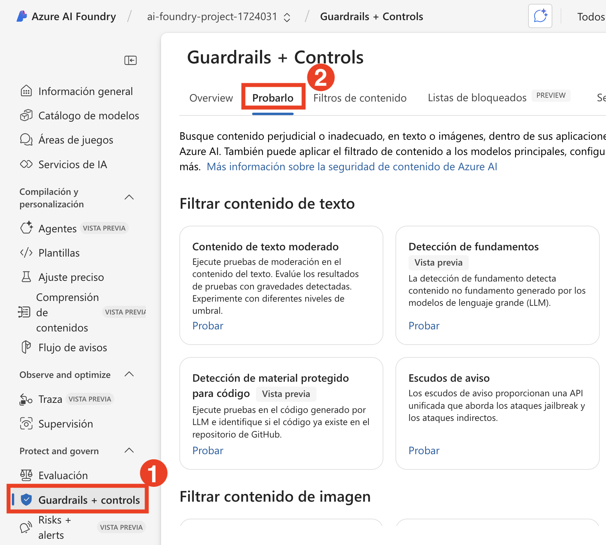
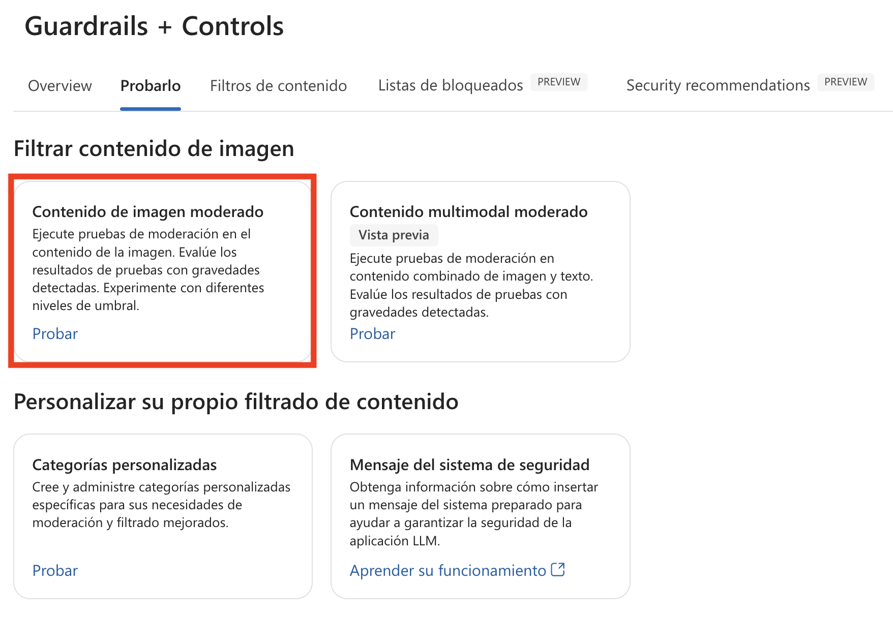
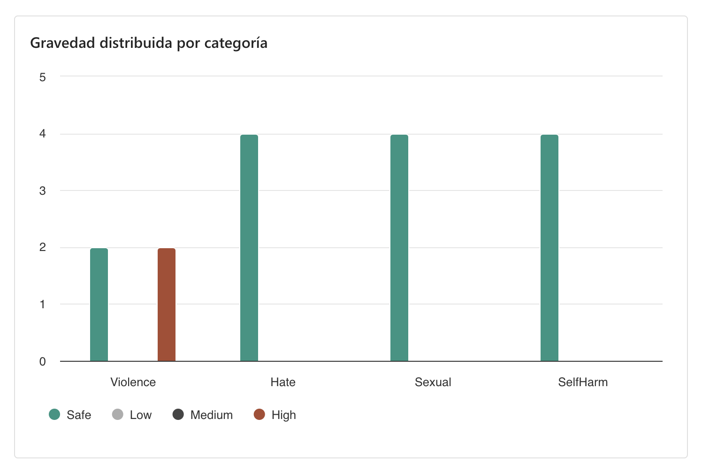
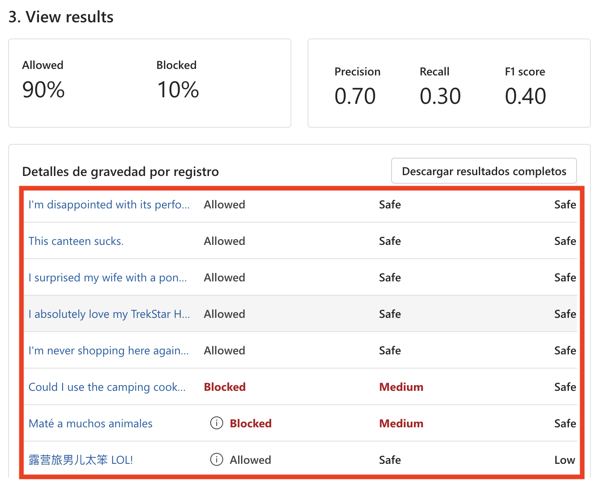

# エクササイズ 6: コンテンツの安全性を確保する責任ある AI の実践 

## ラボ概要
このラボでは、Azure AI Foundry を使用して責任ある AI の実践を実装するためのハンズオン体験を提供します。参加者は、Azure の組み込みの責任ある AI ツールを活用しながら、公平性、透明性、プライバシー、セキュリティの考慮事項についての理解を深めます。このラボでは、バイアスの検出と軽減、モデルの解釈可能性の確保、プライバシー保護技術の適用、セキュリティとコンプライアンスのベストプラクティスの強化に焦点を当てます。

## ラボの目的
このラボでは、以下のタスクを実行します：

- タスク 1: Azure AI Foundry を使用した画像とテキストのモデレーション

## アカウントに Cognitive Services Userの役割を割り当てます 

1.	Azure ポータル +++https://portal.azure.com+++ で、my-ai-service@lab.LabInstance.Id という名前のリソースを見つけます。
   
2.	Access Control (IAM)を選択してください。
   
3.	Add>Add Role Assignmentを選択してください。
   
4.	「Job function roles」の下で、「+++Cognitive Services User+++」を検索して 選択し、「Next」を選択します。
   
5.	+Select membersを選択してください。
    
6.	 +++user1-@lab.LabInstance.Id+++を検索して選択します。
    
7.	Review + assignを選択してください。
    
8.	次のタスクに進む前に、新しいロールが有効になるまで 3 ～ 5 分待つ必要がある場合があります。

## タスク 1.1 : Azure AI Foundry を使用した画像とテキストのモデレーション

このタスクでは、**Azure AI Foundry** を活用して、不適切、有害、または機密性の高いコンテンツを検出し、画像とテキストをモデレーションします。AI モデルを使用してコンテンツを分析・フィルタリングし、事前定義されたポリシーに基づいてコンプライアンスと安全性を確保します。

1. **Azure AI Foundry** ポータルで、**評価と改善** の **安全性とセキュリティ (1)** を選択し、**試してみる (2)** をクリックします。

          

2. **画像コンテンツをフィルターする** オプションで、**画像コンテンツをモデレートする** を選択します。

     

3. **画像コンテンツをモデレートする** のページで、**シンプルなテストを実行する (1)** を選択し、オプションを確認します。3 つの設定済みコンテンツ (**安全なコンテンツ**, **自己傷害コンテンツ**, **AI生成の性的コンテンツ**) があります **(2)**。

     

#### 安全なコンテンツ

1. 開始前に、以下の Azure AI サービスを選択し、ラボを進めます。

     

2. 画像を使用してテストを実施し、結果を確認しましょう。**シンプルなテストを実行する** タブで、**安全なコンテンツ (1)** を選択し、**ファイルを選択 (2)** をクリックします。

     

3. **ファイルエクスプローラー** で、**C:\LabFiles\Day-4-Developing-AI-App-with-Azure-AI-Foundry\Model-Evaluation-and-Model-Tunning\Labs\data\image_sample_dataset (1)** を開きます。**family-builds-campfire.jpg (2)** を選択し、**開く (3)** をクリックします。 

     

4. 画像を確認し、**テストを実行 ** をクリックします。

    
   
5. 結果を確認してください。予想通り、この画像コンテンツは **許可済み** であり、すべてのカテゴリで **安全** と判定されました。 

    

   >**注:** これまで、単一の画像に対してコンテンツをテストしてきました。しかし、大量の画像データセットがある場合、モデルのパフォーマンスに基づいて一括テストを行うことも可能です。

#### 自己傷害コンテンツ

ユーザーが有害な画像コンテンツを投稿する可能性を考慮する必要があります。このようなシナリオを想定し、有害コンテンツの検出をテストしてみましょう。

1. **自己傷害コンテンツ (1)** を選択し、**ファイルを選択 (2)** をクリックします。

    

2. **ファイルエクスプローラー** で、`C:\LabFiles\Day-4-Developing-AI-App-with-Azure-AI-Foundry\Model-Evaluation-and-Model-Tunning\Labs\data\image_sample_dataset` に移動し、**bear-attack-blood.JPG** ファイルをアップロードします。

3. すべての閾値レベルを **中（Medium）** に設定します。

4. **テストを実行 ** を選択します。

    >**注:** このコンテンツは **ブロック** され、暴力フィルターによって拒否されました。暴力フィルターの重大度レベルは 高（High）と判定されました。

### タスク 1.2 : 一括テストの実行

ここまで、単一の画像に対してコンテンツをテストしてきました。しかし、大量の画像データセットがある場合、一括でテストを実施し、モデルのパフォーマンスに関するメトリクスを取得することが可能です。

1. **画像コンテンツをモデレートする** のページで、**一括テストを実行 (1)** を選択し、**ファイルを選択 (2)** をクリックします。

     .png)

2. ファイルエクスプローラーで、**C:\LabFiles\Day-4-Developing-AI-App-with-Azure-AI-Foundry\Model-Evaluation-and-Model-Tunning\Labs\data** を開き、**image_sample_dataset.zip (1)** フォルダを選択して **開く (2)** をクリックします。 

    
   
3. テストセクションで、**データセットのプレビュー (1)** を確認し、**フィルターを設定** タブを選択します。**カテゴリ** と **閾値レベル** を確認 **(2)** し、**テストを実行  (3)** をクリックします。

     

4. **結果** を確認してください。

   

   

### タスク 1.3 : Moderate text content を使用したテキストモデレーション 

AI モデルを活用することで、お客様のテキスト入力が有害かどうかを検出し、その結果を使用して適切な対応策を講じることができます。

#### 安全なコンテンツ

まずは、ポジティブな顧客フィードバックをテストしてみましょう。

1. **Azure AI Foundry** ポータルに戻り、**安全性とセキュリティ (1)** の下にある **テキストコンテンツをモデレートする** を選択します。

   

2. **テキストコンテンツをモデレートする** のページで、**シンプルなテストを実行する (1)** を選択し、**サンプルを選択するか、自分で入力する** セクションで **安全なコンテンツ (2)** を選択します。

   

3. **テストボックス** に以下を入力します：

     - **I recently used the PowerBurner Camping Stove on my camping trip, and I must say, it was fantastic! It was easy to use, and the heat control was impressive. Great product! (1)**
     >**任意:** 日本語訳は - 最近キャンプに行った際に、PowerBurner キャンプストーブを使用しましたが、本当に素晴らしかったです！使いやすく、熱調節も非常に優れていました。最高の製品です！

     - すべての閾値レベルを **中 (Medium) (2)** に設定します。

     - **テストを実行  (3)** を選択します。

       
     
4. 結果を確認してください。

    

    >**注** コンテンツは **許可されました**。すべてのカテゴリで安全であることが確認されました。この結果は、顧客のポジティブで有害ではないフィードバックに基づくものです。

#### 有害なコンテンツ

では、有害な発言をテストした場合どうなるでしょうか？今回は、否定的な顧客フィードバックをテストしてみます。製品に不満を抱くことは問題ありませんが、侮辱的な発言やブランドを貶める言葉は避けるべきです。

1. **テストボックス** に以下を入力します：

    - **I recently bought a tent, and I have to say, I'm really disappointed. The tent poles seem flimsy, and the zippers are constantly getting stuck. It's not what I expected from a high-end tent. You all suck and are a sorry excuse for a brand**. **(1)**
    >**任意:** 日本語訳は - 最近テントを購入しましたが、非常にがっかりしました。テントのポールは頼りなく、ジッパーは常に引っかかります。高級テントとは思えません。お前らは最低のブランドだ。

     - すべての閾値レベルを **中 (Medium) (2)** に設定します。

     - **テストを実行  (3)** を選択します。

      
 
   - このコンテンツは **許可されています** が、ヘイトカテゴリーの重大度レベルは「低」と判定されました。ヘイトコンテンツをブロックするために、**ヘイトの閾値レベルを「低 (Low)」(2)** に変更する必要があります。これにより、重大度が「低・中・高」のいずれのコンテンツもブロックされるようになります。

   - ヘイトの閾値レベルを **低 (Low) (2)** に設定します。

   - **テストを実行  (3)** を選択します。

     
    
   - 今回のコンテンツは **ブロックされ**、ヘイトカテゴリーのフィルターによって拒否されました。

      

#### 誤字を含む暴力的なコンテンツ

すべての顧客のテキストコンテンツが誤字なしとは限りません。幸い、**Moderate text content** ツールは、誤字を含むコンテンツでも有害性を検出できます。今回は、アライグマに関する事故についてのフィードバックをテストしてみましょう。

1. **誤字を含む暴力的なコンテンツ** を選択します。

    

2. **テストボックス** に以下を入力します：

    - **I recently purchased a camping cooker, but we had an accident. A racon got inside, was shocked, and died. Its blood is all over the interior. How do I clean the cooker?**
    >**任意:** 日本語訳は - 最近キャンプ用コンロを購入しましたが、事故がありました。アライグマが中に入ってショックを受け、死亡しました。内部は血まみれです。どうやって掃除すればいいですか？

     - すべての閾値レベルを **中 (Medium) (2)** に設定します。

     - **テストを実行  (3)** を選択します。

    - このコンテンツは許可されましたが、暴力の重大度レベルは「低」と判定されています。このようなコンテンツをブロックするために、**暴力の閾値レベルを調整** することも考えられますが、それは適切でしょうか？例えば、顧客が AI を活用したカスタマーサポートと会話しており、コンロの掃除方法について質問している場面を想像してください。この質問には悪意がない可能性があり、必ずしもブロックすべきではないかもしれません。開発者として、こうしたコンテンツが許容されるべきケースを慎重に検討し、フィルターの調整を決定してください。
  
#### 一括テストを実行する
ここまで、単一のテキストコンテンツをテストしてきました。しかし、大量のテキストデータセットがある場合、一括でテストを行い、モデルのパフォーマンスを評価することができます。

顧客から提供された大量の画像データセットがあります。このデータセットには、有害なコンテンツを検出するモデルの能力をテストするためのサンプルの有害画像も含まれています。データセット内の各レコードには、そのコンテンツが有害かどうかを示すラベルが付いています。今回は、このデータセットを使用してもう一度テストを実施しましょう！

1. **一括テストを実行 (1)** タブに切り替え、**ファイルを選択 (2)** を選択します。

    

2. **ファイルエクスプローラー** で **C:\LabFiles\Day-4-Developing-AI-App-with-Azure-AI-Foundry\Model-Evaluation-and-Model-Tunning\Labs\data** に移動し、**bulk-image-moderation-dataset.csv (2)** ファイルを選択し、**開く (2)** をクリックします。
   
    >**注**: CSV ファイルの名前は異なる場合があります。
   
     
     
3.  **データセットのプレビュー (1)** セクションで、レコードと対応するラベルを確認します。「0」はコンテンツが許容可能 (非有害) であることを示し、「1」はコンテンツが許容不可能 (有害) であることを示します **(2)**。

     - すべての閾値レベルを **中 (Medium) (3)** に設定します。

     - **テストを実行  (4)** を選択します。
   
       

4. 結果を確認します。

    

    

## レビュー
このラボでは、以下のタスクを完了しました：
- 画像のモデレーション: 単体および一括画像の安全性、自己傷害、有害コンテンツの検出  
- テキストのモデレーション: 安全および有害なテキストを解析し、誤字を含むコンテンツもテスト  
- 結論: Azure AI Content Safety はコンテンツモデレーションを強化し、コンプライアンスと安全なデジタル空間を実現します。

### ラボを完了しました。
