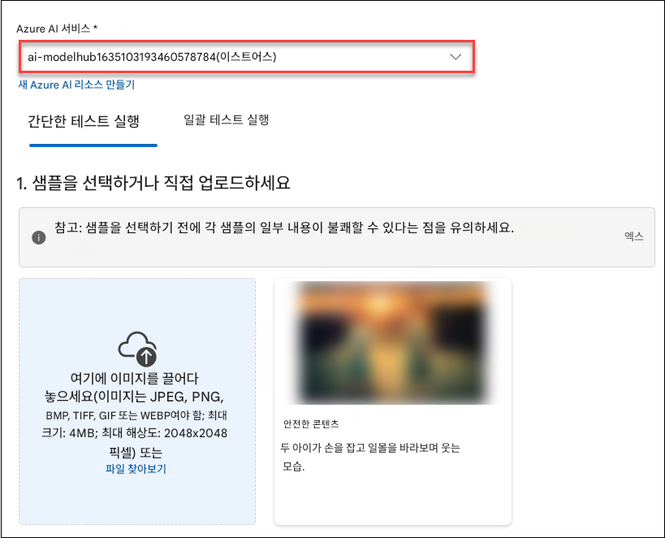
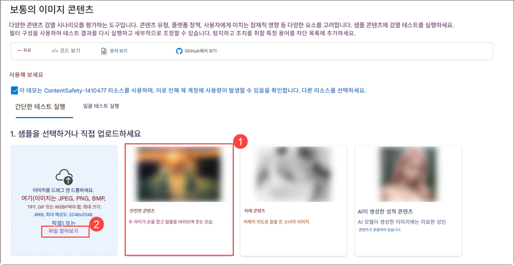
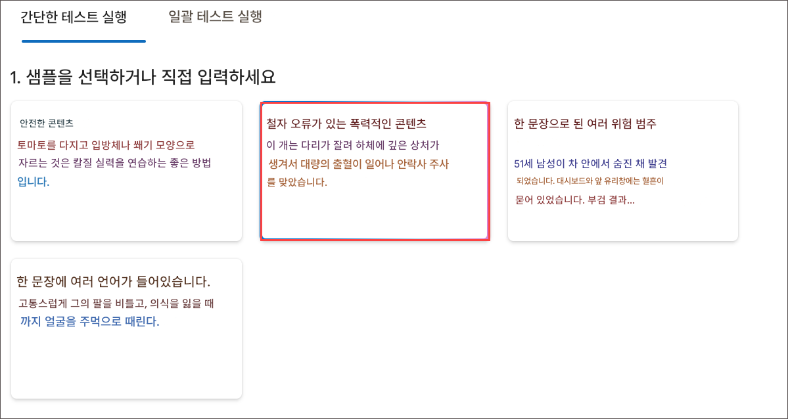

# 실습 6: 콘텐츠 안전성(Content Safety) 기능을 활용한 책임 있는 AI 구현

## 개요

이 실습에서는 Azure AI Foundry를 활용하여 책임 있는 AI(Responsible AI) 실천을 구현하는 실습을 진행합니다. 참여자는 공정성, 투명성, 개인정보 보호, 보안에 대한 고려사항을 이해하고, Azure에 내장된 책임 있는 AI 도구를 활용하는 방법을 학습하게 됩니다. 실습의 핵심은 편향 탐지 및 완화, 모델 해석 가능성 확보, 개인정보 보호 기술 적용, 보안 및 규정 준수 모범 사례의 적용에 중점을 둡니다.

## 목표

이 실습에서 여러분은 다음 과제를 수행하게 됩니다:
- 과제 1: Azure AI Foundry를 활용한 이미지 및 텍스트 콘텐츠 통제

## 과제 1.1: Azure AI Foundry를 활용한 이미지 및 텍스트 콘텐츠 통제

이 과제는 **Azure AI Foundry**를 사용하여 부적절하거나 해로운, 혹은 민감한 콘텐츠를 탐지함으로써 이미지 및 텍스트를 필터링(Moderation)하는 작업입니다. 이 기능은 사전 정의된 정책에 기반하여 콘텐츠를 분석하고 걸러내는 AI 모델을 활용하여 애플리케이션의 **준수(Compliance)** 및 **안전(Safety)** 을 보장합니다.

1. **Azure AI Foundry** 포털에서 **평가 및 개선** 항목 아래의 **안전 + 보안 (1)** 를 선택한 다음, **사용해 보기 (2)** 를 클릭합니다.

   

1. **이미지 콘텐츠 필터링** 옵션에서 **이미지 콘텐츠 조정**를 선택합니다.

   

1. **이미지 콘텐츠 조정** 화면에서 **간단한 테스트 실행 (1)** 탭을 선택한 후 옵션들을 확인합니다. 콘텐츠는 **안전한 콘텐츠**, **자해 콘텐츠**, **AI 생성 성적 콘텐츠** 의 세 가지 유형으로 구분되어 있습니다 **(2)**.

   

#### 안전한 콘텐츠

1. 시작하기 전에 아래와 같이 **Azure AI Services**를 선택한 후, 해당 서비스로 실습을 진행합니다.

   

1. 이제 이미지를 사용하여 테스트를 수행하고 결과를 확인해 보겠습니다. **간단한 테스트 실행** 탭에서 **안전한 콘텐츠 (1)** 를 선택한 후 **파일 찾아보기 (2)** 를 클릭합니다.

   

1. **파일 탐색기**에서 다음 경로로 이동합니다:
   **C:\LabFiles\Day-4-Developing-AI-App-with-Azure-AI-Foundry\Model-Evaluation-and-Model-Tunning\Labs\data\image\_sample\_dataset (1)**
   Enter 키를 누른 후, **family-builds-campfire.jpg (2)** 파일을 선택하고 **Open (3)** 을 클릭합니다.

   

1. 이미지를 검토한 후 **테스트 실행** 를 클릭합니다.

   

1. 결과를 확인합니다. 예상대로, 이 이미지 콘텐츠는 **허용됨** 으로 분류되며, 모든 범주에서 심각도 수준은 **Safe** 로 표시됩니다.

   

   > **참고**: 지금까지는 개별 이미지 콘텐츠에 대해 테스트를 수행했습니다. 그러나 이미지 콘텐츠가 포함된 대량 데이터셋이 있다면, 해당 데이터셋을 한 번에 테스트하여 모델의 성능 기반으로 메트릭 결과를 받을 수 있습니다.

#### 자해 콘텐츠

사용자가 해로운 이미지 콘텐츠를 게시할 가능성도 염두에 두어야 합니다. 이러한 시나리오에 대비하기 위해, 해로운 이미지 콘텐츠 감지 기능을 테스트해 보겠습니다.

1. **자해 콘텐츠 (1)** 를 선택한 후 **파일 찾아보기 (2)** 를 클릭합니다.

   

1. **파일 탐색기**에서 다음 경로로 이동합니다:
   `C:\LabFiles\Day-4-Developing-AI-App-with-Azure-AI-Foundry\Model-Evaluation-and-Model-Tunning\Labs\data\image_sample_dataset`
   그런 다음 **bear-attack-blood.JPG** 파일을 업로드합니다.

1. 모든 **임계값 수준** 을 **Medium(중간)** 으로 설정합니다.

1. **테스트 실행** 를 선택합니다.

   > **참고**: 예상대로 해당 콘텐츠는 차단되었으며, **Violence** (폭력) 필터에 의해 **High** (높음) 수준의 심각도로 거부되었습니다.

### 과제 1.2: 대량 테스트 실행하기

지금까지는 개별 이미지에 대해 테스트를 수행했습니다. 하지만 다수의 이미지 콘텐츠가 포함된 데이터셋이 있다면, 이 대량 데이터셋을 한 번에 테스트하고 모델 성능 기반의 메트릭을 확인할 수 있습니다.

1. **이미지 콘텐츠 조정**에서 **대량 테스트 실행 (1)** 탭을 선택한 다음, **파일 찾아보기 (2)** 를 클릭합니다.

   .png)

1. **파일 탐색기**에서 다음 경로로 이동합니다:
   **C:\LabFiles\Day-4-Developing-AI-App-with-Azure-AI-Foundry\Model-Evaluation-and-Model-Tunning\Labs\data** 로 이동한 후 **image\_sample\_dataset.zip (1)** 파일을 선택하고 **Open (2)** 를 클릭합니다.

   

1. **Test** 섹션에서 **데이터 세트 미리 보기 (4 레코드) (1)** 를 검토한 후, **필터 구성** 탭을 선택하여 **범주** 와 **임계값 수준** 을 확인하고 **테스트 실행 (3)** 를 클릭합니다.

   

1. **결과** 를 확인합니다.

   

   

### 과제 1.3: 텍스트 필터링 - Moderate text content 사용

고객이 입력한 텍스트가 해로운지 여부를 감지하기 위해 AI 모델을 활용할 수 있습니다. 이후 감지 결과를 바탕으로 적절한 예방 조치를 구현할 수 있습니다.

#### 안전한 텍스트 콘텐츠

먼저, 긍정적인 고객 피드백을 테스트해 보겠습니다.

1. **Azure AI Foundry** 포털 > **안전 + 보안 (1)** 로 돌아간 후, **사용해 보기** 아래에서 **텍스트 콘텐츠 조정** 을 선택합니다.

   

1. **텍스트 콘텐츠 조정** 페이지에서 **간단한 테스트 실행 (1)** 을 선택하고, **샘플을 선택하거나 직접 입력** 섹션에서 **안전한 콘텐츠 (2)** 를 선택합니다.

   

1. **Test box** 에 다음 문장을 입력합니다:

   - **I recently used the PowerBurner Camping Stove on my camping trip, and I must say, it was fantastic! It was easy to use, and the heat control was impressive. Great product! (1)** (저는 최근 캠핑 여행에서 PowerBurner 캠핑 스토브를 사용했는데, 정말 훌륭했습니다! 사용하기도 간편했고, 열 조절도 인상적이었어요. 정말 좋은 제품입니다!)

   - 모든 **임계값 수준** 을 **중간 (2)** 으로 설정합니다.

   - **테스트 실행 (3)** 를 선택합니다.

     

1. **결과** 를 검토합니다.

   

   > **참고**: 해당 콘텐츠는 **허용됨** 으로 분류되었으며, 모든 범주에서 **Safe** 수준의 심각도로 판단되었습니다. 이는 고객 피드백이 긍정적이고 해롭지 않은 내용을 담고 있기 때문에 예상된 결과입니다.

#### 유해한 텍스트 콘텐츠

그렇다면 유해한 발언을 테스트하면 어떤 결과가 나올까요? 이번에는 부정적인 고객 피드백을 사용해 보겠습니다. 제품을 마음에 들어 하지 않는 것은 괜찮지만, **욕설이나 비하하는 발언은 허용되어서는 안 됩니다.**

1. **텍스트 창** 에 다음 문장을 입력합니다:

   - **I recently bought a tent, and I have to say, I'm really disappointed. The tent poles seem flimsy, and the zippers are constantly getting stuck. It's not what I expected from a high-end tent. You all suck and are a sorry excuse for a brand.** **(1)** (최근에 텐트를 구입했는데, 정말 실망스러웠습니다. 텐트 폴대는 약해 보이고, 지퍼는 계속 걸려서 제대로 작동하지 않았어요. 고급 텐트에서 기대했던 품질이 전혀 아니었습니다.) 

   - 모든 **임계값 수준** 을 **중간 (2)** 으로 설정합니다.

   - **테스트 실행 (3)** 를 클릭합니다.

     

   - 해당 콘텐츠는 **허용됨** 으로 판단되었지만, **Hate** (혐오) 항목의 심각도는 **Low** 로 평가되었습니다. 이러한 콘텐츠를 차단하도록 모델을 유도하려면 **Hate 항목의 임계값** 을 더 낮게 조정해야 합니다. **임계값을 낮추면 낮음, 중간, 높음 수준의 콘텐츠 모두 차단**됩니다. 예외는 없습니다!

   - **Hate 항목의 임계값을 `낮음` (2)** 로 설정합니다.

   - 다시 **테스트 실행 (3)** 를 클릭합니다.

     

   - 이번에는 콘텐츠가 **Blocked** 으로 표시되었으며, **Hate 범주** 의 필터에 의해 거부되었습니다.

     

#### 철자가 틀린 폭력적인 콘텐츠

고객이 입력한 모든 텍스트 콘텐츠가 철자 오류 없이 완벽할 것이라고 기대할 수는 없습니다. 다행히도, **텍스트 콘텐츠 조정** 도구는 **철자 오류가 있더라도 유해한 콘텐츠를 감지**할 수 있습니다. 이번에는 라쿤과 관련된 사고에 대한 고객 피드백을 통해 이 기능을 테스트해 보겠습니다.

1. **철자가 틀린 폭력적인 콘텐츠** 항목을 선택합니다.

   

1. **텍스트 창** 에 다음 문장을 입력합니다:

   - **I recently purchased a campin cooker, but we had an accident. A racon got inside, was shocked, and died. Its blood is all over the interior. How do I clean the cooker?** (저는 최근에 캠핀 쿡커를 샀는데, 사고가 있었어요. 라쿤이 안으로 들어갔다가 감전돼서 죽었어요. 안쪽에 피가 온통 묻어 있어요. 쿡커를 어떻게 청소해야 하나요?)

   - 모든 **임계값 수준** 을 **중간** 으로 설정합니다.

   - **테스트 실행** 를 클릭합니다.

   - 해당 콘텐츠는 허용됨으로 판단되었으며, Violence (폭력) 항목의 심각도 수준은 Low 으로 평가 되었습니다. 이와 같은 콘텐츠를 차단하고자 한다면 Violence 필터의 임계값을 낮게 조정할 수 있습니다. 그러나 과연 그럴 필요가 있을까요? 예를 들어, 고객이 AI 기반 고객 지원 에이전트와의 대화 중 해당 질문을 통해 조리기구를 어떻게 청소해야 하는지 문의하고 있다면, 이 질문에는 악의가 없을 수 있습니다. 따라서 이런 콘텐츠를 무조건 차단하기보다는 상황에 따라 허용하는 것이 더 적절할 수도 있습니다. 개발자의 입장에서, 콘텐츠 차단 필터를 조정하기 전에 어떤 상황에서 해당 콘텐츠가 허용될 수 있을지 다양한 시나리오를 고려하는 것이 중요합니다.

#### 대량 테스트 실행하기

지금까지는 개별 이미지에 대해 콘텐츠 안전성을 테스트했습니다. 하지만 고객이 제공한 이미지 콘텐츠의 대량 데이터 세트가 있는 경우, 이 데이터를 한 번에 테스트하고 모델 성능 기반 메트릭을 수신할 수 있습니다.

가상의 고객으로부터 전달받은 데이터 세트를 준비해 두었습니다. 이 데이터 세트에는 모델이 유해 콘텐츠 임을 감지할 수 있는지를 평가하기 위해 유해한 이미지도 포함시켜 두었습니다. 각 레코드에는 콘텐츠가 유해한지 여부를 나타내는 라벨이 포함되어 있습니다. 이제 이 데이터 세트를 사용하여 또 한 번의 테스트를 수행해 보겠습니다!

1. **대량 테스트 실행 (1)** 탭으로 전환한 다음 **파일 찾아보기 (2)** 을 선택합니다.

   

1. **파일 탐색기** 에서 **C:\LabFiles\Day-4-Developing-AI-App-with-Azure-AI-Foundry\Model-Evaluation-and-Model-Tunning\Labs\data** 로 이동하여 **bulk-text-moderation-dataset.csv (2)** 파일을 선택하고 **Open (2)** 을 클릭합니다.

   > 참고: CSV 파일 이름은 다를 수 있습니다.
   > 

1. **epdlxj tpxm 미리 보기(30 레코드) (1)** 에서 레코드와 해당 라벨을 살펴봅니다. `0`은 콘텐츠가 허용 가능(유해하지 않음)함을, `1`은 콘텐츠가 허용 불가(유해한 콘텐츠)임을 나타냅니다 **(2)**

   - 모든 임계값 수준을 **Medium (3)** 으로 설정합니다.
   - **테스트 실행 (4)** 를 선택합니다.
     

1. 결과를 확인합니다.
   
   

## 복습

이 실습에서는 다음 작업을 완료했습니다:

- 이미지 통제(Image Moderation): 단일 이미지 및 대량 이미지에 대해 안전성, 자해, AI 생성 콘텐츠 여부를 테스트했습니다.
- 텍스트 통제(Text Moderation): 철자 오류가 있는 경우를 포함해 안전한 텍스트와 유해 텍스트를 분석했습니다.
- 결론: Azure AI Content Safety는 컴플라이언스를 강화하고 더욱 안전한 디지털 환경 조성을 지원합니다.

### 실습을 성공적으로 완료하였습니다.

