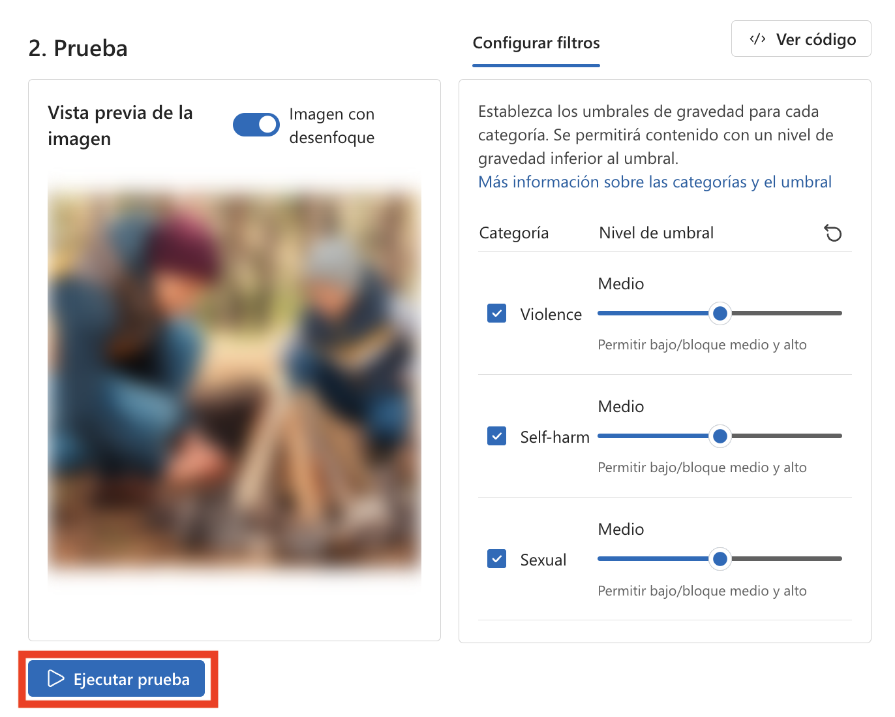
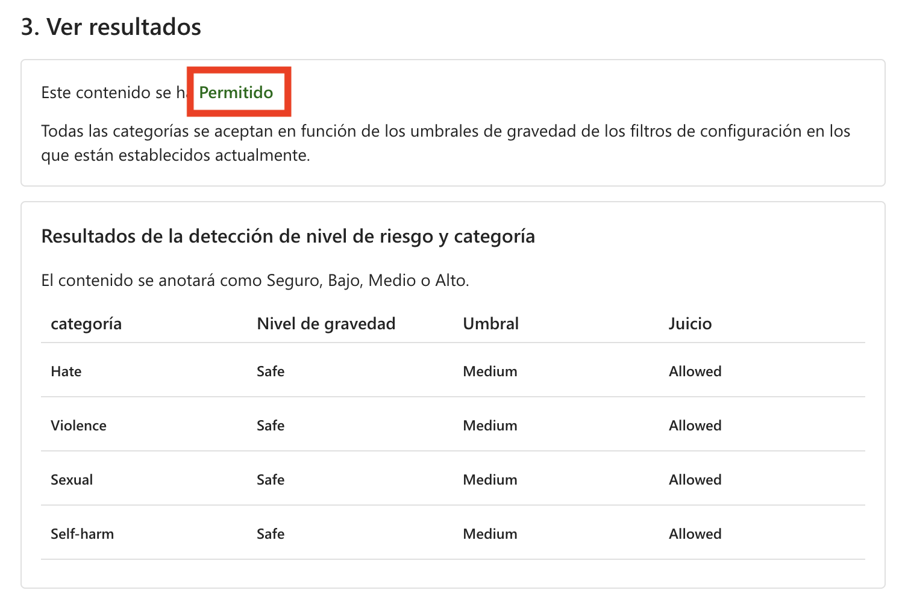
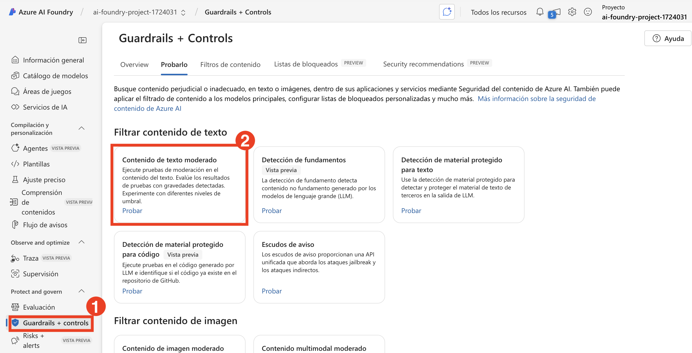

# 练习 6：使用内容安全确保负责任的 AI 实践

## 实验概述
本实验提供使用 Azure AI Foundry 实施负责任的 AI 实践的实践经验。参与者将在利用 Azure 内置的负责任 AI 工具的同时，获得对公平性、透明度、隐私和安全性考虑的见解。实验重点关注检测和缓解偏见、确保模型可解释性、应用隐私保护技术以及执行安全性和合规性最佳实践。

**实验室目标**

在本练习中，您将执行以下作:

- 任务 1: 为帐户分配认知服务用户角色

- 任务 2 : 使用 Azure AI Foundry 进行图像和文本审核

### 任务1: 为帐户分配认知服务用户角色

1.  在Azure portal
    +++[https://portal.azure.com+++](https://portal.azure.com+++/),
    查找名为 [**my-ai-service@lab.LabInstance.Id**](mailto:my-ai-service@lab.LabInstance.Id).

2.  选择 **Access Control (IAM)**.

3.  选择 **Add > Add Role Assignment**.

   

4.  在“工作职能角色”下, 搜索并选择 +++Cognitive Services User+++,
    然后选择 **Next**.

   

5.  选择 **+Select members**.

6.  搜索并选择<+++user1-@lab.LabInstance.Id>+++.

   

7.  选择 **Review + assign**.

8.  您可能需要等待 3-5
    分钟才能让新角色生效，然后才能继续执行下一个任务。

## 任务 1：使用 Azure AI Foundry 进行图像和文本审核

此任务涉及使用 **Azure AI Foundry** 通过检测不当、有害或敏感内容来审核图像和文本。它利用 AI 模型基于预定义的策略分析和过滤内容，确保应用程序的合规性和安全性。

1. 在 **Azure AI Foundry** 门户中，在 **评估和改进（Assess and Improve）** 下选择 **安全与安保（Safety + Security）(1)**，然后选择 **立即尝试（Try it Out）(2)**。

   

2. 在 **过滤图像内容（Filter image content）** 选项下，选择 **审核图像内容（Moderate image content）**。

   

3. 在 **审核图像内容（Moderate image content）** 中选择 **运行简单测试（Run a simple test）(1)** 标签，查看选项，注意我们有三组内容：**安全内容（Safe content）**、**自我伤害内容（self-harm content）** 和 **AI生成的色情内容（AI-generated sexual content）**。**(2)**

   

#### 安全内容（Safe content）

1. 在开始之前，选择下面的 Azure AI services，并使用此 Azure AI services 继续实验。

   

2. 现在让我们使用我们的图像进行测试并检查结果。在 **运行简单测试（Run a simple test）** 标签页上，选择 **安全内容（Safe content）(1)** 然后点击 **浏览文件（Browse for a file）(2)**。

   

3. 在 **文件资源管理器（file explorer）** 中导航到 **C:\LabFiles\Day-4-Developing-AI-App-with-Azure-AI-Foundry\Model-Evaluation-and-Model-Tunning\Labs\data\image_sample_dataset (1)** 按 **Enter**，然后选择 **family-builds-campfire.jpg (2)** 并点击 **打开（Open）(3)**。

   

4. 查看图像并点击 **运行测试（Run test）**。

   

5. 查看结果。如预期的那样，此图像内容被 **允许（Allowed）**，并且在所有类别中的严重性级别都是 **安全（Safe）**。

   

   >**注意**：到目前为止，我们已经测试了单个独立图像的内容。但是，如果我们有大量的图像数据集，我们可以一次性测试整个数据集，并根据模型的性能接收指标。

#### 自我伤害内容（Self-harm content）

我们还应该预料到客户可能会发布有害的图像内容。为了确保我们考虑到这种情况，让我们测试有害内容的检测。

1. 选择 **自我伤害内容（Self-harm content）(1)** 并点击 **浏览文件（Browse for a file）(2)**。

   

2. 在 **文件资源管理器（file explorer）** 中导航到 `C:\LabFiles\Day-4-Developing-AI-App-with-Azure-AI-Foundry\Model-Evaluation-and-Model-Tunning\Labs\data\image_sample_dataset` 然后上传 **bear-attack-blood.JPG** 文件。

3. 将所有阈值级别设置为 **中等（Medium）**。

4. 选择 **运行测试（Run test）**。

   >**注意**：理所当然，该内容被 **阻止（Blocked）**，并被 **暴力（Violence）** 过滤器拒绝，其严重性级别为 **高（High）**。

### 任务 1.2：运行批量测试（Run a bulk test）

到目前为止，我们已经测试了单个独立图像的内容。但是，如果我们有大量的图像数据集，我们可以一次性测试整个数据集，并根据模型的性能接收指标。

1. 在 **审核图像内容（Moderate image content）** 中选择 **运行批量测试（Run a bulk test）(1)** 标签，然后点击 **浏览文件（Browse for a file）(2)**。

   .png)

2. 在文件资源管理器中导航到 **C:\LabFiles\Day-4-Developing-AI-App-with-Azure-AI-Foundry\Model-Evaluation-and-Model-Tunning\Labs\data** 按 **Enter**。选择 **image_sample_dataset.zip (1)** 文件夹并点击 **打开（Open）(2)**。

   

3. 在测试部分下，查看 **数据集预览（Dataset preview）(1)**，然后选择 **配置过滤器（Configure filters）** 标签查看 **类别（Category）** 和 **阈值级别（Threshold level）** **(2)**，然后点击 **运行测试（Run test）(3)**。

   

4. 查看 **结果**。

   

   

### 任务 1.3：使用审核文本内容（Moderate text content）进行文本审核

我们可以利用 AI 模型来检测来自客户的文本输入是否有害，并在后续使用检测结果来实施必要的预防措施。

#### 安全内容（Safe content）

让我们首先测试一些正面的客户反馈。

1. 返回到 **Azure AI Foundry** 门户 > **安全与安保（Safety + security）(1)**，选择 **审核文本内容（Moderate text content）**。

   

2. 在 **审核文本内容（Moderate text content）** 页面上，选择 **运行简单测试（Run a simple test）(1)** 并在 **选择示例或输入您自己的内容（select a sample or type your own）** 部分下选择 **安全内容（Safe content）(2)**。

   

3. 在 **测试框（Test box）** 中，输入以下内容：

   - **I recently used the PowerBurner Camping Stove on my camping trip, and I must say, it was fantastic! It was easy to use, and the heat control was impressive. Great product!**（**我最近在露营时使用了 PowerBurner 野营炉，不得不说，太棒了！它使用起来很简单，热量控制令人印象深刻。好产品！**）**(1)**

   - 将所有阈值级别设置为 **中等（Medium）(2)**。

   - 选择 **运行测试（Run test）(3)**。

   

4. 查看结果。

   

   >**注意**：内容被 **允许（Allowed）**，并且在所有类别中的严重性级别都是 **安全（Safe）**。考虑到客户反馈的积极和无害性质，这是预期的结果。

#### 有害内容（Harmful content）

但如果我们测试一个有害声明会发生什么？让我们用负面的客户反馈来测试。虽然不喜欢产品是可以的，但我们不想容忍任何辱骂或贬低的声明。

1. 在 **测试框（Test box）** 中，输入以下内容：

   - **I recently bought a tent, and I have to say, I'm really disappointed. The tent poles seem flimsy, and the zippers are constantly getting stuck. It's not what I expected from a high-end tent. You all suck and are a sorry excuse for a brand**（**我最近买了一个帐篷，不得不说，我真的很失望。帐篷杆看起来很脆弱，拉链总是卡住。这不是我对高端帐篷的期望。你们都很糟糕，是个令人遗憾的品牌。**）**(1)**

   - 将所有阈值级别设置为 **中等（Medium）(2)**。

   - 选择 **运行测试（Run test）(3)**。

   

   - 虽然内容被 **允许（Allowed）**，但 **仇恨（Hate）** 的严重性级别为 **低（low）**。为了引导我们的模型阻止此类内容，我们需要调整 **仇恨（Hate）** 的阈值级别。较低的阈值级别会阻止任何低、中或高严重性的内容。没有例外的余地！

   - 将 **仇恨（Hate）** 的阈值级别设置为 **低（Low）(2)**。

   - 选择 **运行测试（Run test）(3)**。

   

   - 现在内容被 **阻止（Blocked）**，并被仇恨类别中的过滤器拒绝。

   

#### 带有拼写错误的暴力内容（Violent content with misspelling）

我们不能预期客户的所有文本内容都没有拼写错误。幸运的是，审核文本内容工具即使在内容有拼写错误的情况下也能检测到有害内容。让我们在关于浣熊事件的额外客户反馈上测试这个功能。

1. 选择 **带有拼写错误的暴力内容（Violent content with misspelling）**。

   

2. 在 **测试框（Test box）** 中，输入以下内容：

   - **I recently purchased a campin cooker, but we had an accident. A racon got inside, was shocked, and died. Its blood is all over the interior. How do I clean the cooker?**（**我最近买了一个野营炉，但我们遇到了一个意外。一只浣熊进去了，触电死亡了。它的血到处都是。我该如何清理这个炉子？**）

   - 将所有阈值级别设置为 **中等（Medium）**。

   - 选择 **运行测试（Run test）**。

   - 虽然内容被 **允许（Allowed）**，但 **暴力（Violence）** 的严重性级别应该是 **低（Low）**。您可以调整 **暴力（Violence）** 的阈值级别来尝试阻止此类内容，但是我们应该这样做吗？考虑一个场景，客户在与 AI 驱动的客户支持代理对话时提出这个问题，希望获得如何清洁炊具的指导。提交这个问题可能没有恶意，因此，不阻止此类内容可能是更好的选择。作为开发人员，在决定调整过滤器和阻止类似内容之前，请考虑各种可能的场景。

#### 运行批量测试（Run a bulk test）

到目前为止，我们已经测试了单个独立图像的内容。但是，如果我们有大量的图像数据集，我们可以一次性测试整个数据集，并根据模型的性能接收指标。

我们有一个客户提供的图像批量数据集。该数据集还包括示例有害图像，用于测试模型检测有害内容的能力。数据集中的每条记录都包含一个标签，用于指示内容是否有害。让我们用这个数据集再进行一轮测试！

1. 切换到 **运行批量测试（Run a bulk test）(1)** 标签。选择 **浏览文件（Browse for a file）(2)**。

   

2. 在 **文件资源管理器（file explorer）** 中导航到 **C:\LabFiles\Day-4-Developing-AI-App-with-Azure-AI-Foundry\Model-Evaluation-and-Model-Tunning\Labs\data** 按 **Enter**。选择 **bulk-image-moderation-dataset.csv (2)** 文件并点击 **打开（Open）(2)**。

   > 注意：CSV 文件的名称可能会有所不同。

   

3. 在 **数据集预览部分（Dataset preview section）(1)** 中，浏览记录及其对应的标签。0 表示内容可接受（无害）。1 表示内容不可接受（有害内容）。**(2)**

   - 将所有阈值级别设置为 **中等（Medium）(3)**。

   - 选择 **运行测试（Run test）(4)**。

   

4. 查看结果。

   

   

## 回顾
在本实验中，您已完成以下任务：
- 图像审核：测试了单个和批量图像的安全性、自我伤害和 AI 生成的内容。
- 文本审核：分析了安全和有害文本，包括拼写错误，并进行了批量测试。
- 结论：Azure AI Content Safety 增强了内容审核，以实现合规性和更安全的数字空间。

### 您已成功完成实验。 