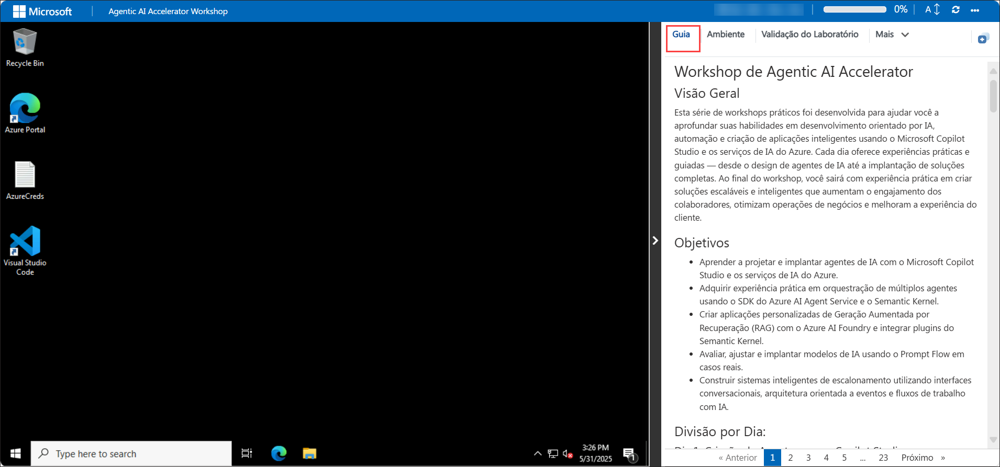
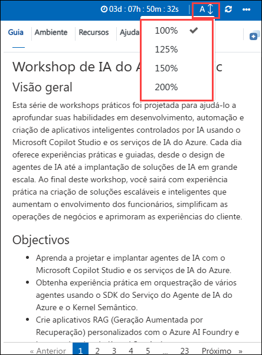
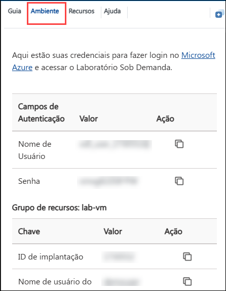
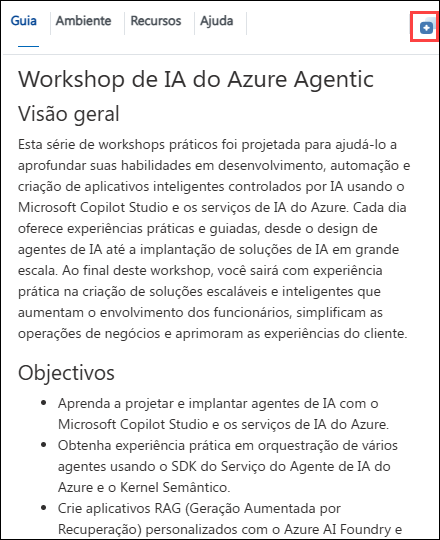
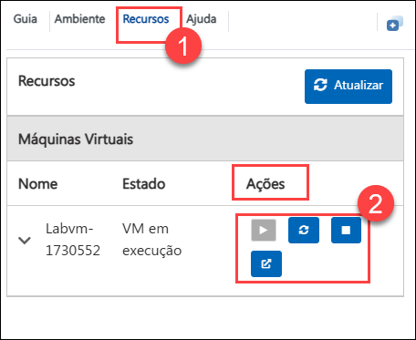
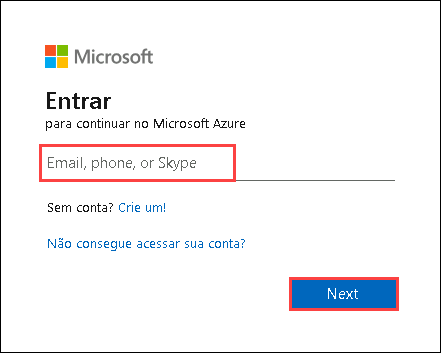
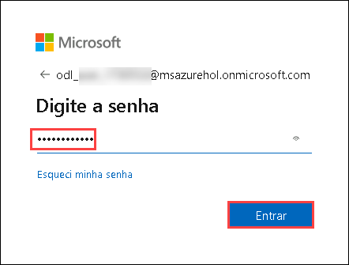

# Workshop de Agentic AI Accelerator

## Visão Geral

Esta série de workshops práticos foi desenvolvida para ajudar você a aprofundar suas habilidades em desenvolvimento orientado por IA, automação e criação de aplicações inteligentes usando o Microsoft Copilot Studio e os serviços de IA do Azure. Cada dia oferece experiências práticas e guiadas — desde o design de agentes de IA até a implantação de soluções completas. Ao final do workshop, você sairá com experiência prática em criar soluções escaláveis e inteligentes que aumentam o engajamento dos colaboradores, otimizam operações de negócios e melhoram a experiência do cliente.

## Objetivos

* Aprender a projetar e implantar agentes de IA com o Microsoft Copilot Studio e os serviços de IA do Azure.
* Adquirir experiência prática em orquestração de múltiplos agentes usando o SDK do Azure AI Agent Service e o Semantic Kernel.
* Criar aplicações personalizadas de Geração Aumentada por Recuperação (RAG) com o Azure AI Foundry e integrar plugins do Semantic Kernel.
* Avaliar, ajustar e implantar modelos de IA usando o Prompt Flow em casos reais.
* Construir sistemas inteligentes de escalonamento utilizando interfaces conversacionais, arquitetura orientada a eventos e fluxos de trabalho com IA.

## Divisão por Dia:

### Dia 1: Criação de Agentes com o Copilot Studio

Neste laboratório prático, você aprenderá a usar o Microsoft 365 Copilot e o Copilot Studio para melhorar a experiência dos colaboradores por meio de criatividade e automação baseadas em IA. Você criará conteúdos visuais, facilitará transições de funcionários, automatizará processos de onboarding e implementará sistemas de reconhecimento para aumentar o engajamento e a produtividade.

### Dia 2: Agentes de IA com Azure

Este laboratório prático oferece uma introdução abrangente à criação de agentes de IA utilizando o SDK do Azure AI Agent Service e o Semantic Kernel. Você começará criando agentes com o Azure AI Agent Service e utilizando o Semantic Kernel para orquestrá-los em um sistema de múltiplos agentes. Durante o laboratório, você explorará técnicas de colaboração entre agentes, automação e execução de tarefas. Ao final, terá experiência prática no design, implantação e gerenciamento de agentes de IA para criar aplicações inteligentes, escaláveis e eficientes.

### Dia 3: Desenvolvendo uma Aplicação RAG Personalizada com Azure AI Foundry e Explorando o Semantic Kernel

Este laboratório prático oferece uma introdução à construção de uma aplicação de Geração Aumentada por Recuperação (RAG) personalizada usando o SDK do Azure AI Foundry. Você começará provisionando os recursos necessários no Azure e configurando o ambiente do Foundry. Em seguida, implementará um pipeline RAG de ponta a ponta que indexa e recupera dados relevantes para enriquecer as respostas geradas por IA.
Durante o laboratório, você também integrará o Semantic Kernel para criar interações dinâmicas baseadas em prompts e incorporará plugins úteis — como utilitários de tempo e clima — para ampliar a funcionalidade do chatbot.
Ao final da sessão, você terá experiência prática na construção de uma solução RAG escalável que utiliza o poder da IA do Azure e o ecossistema de plugins do Semantic Kernel para recuperação avançada de conhecimento e geração de respostas inteligentes.

### Dia 4: Desenvolvendo Aplicações de IA com Azure AI Foundry

Este laboratório prático é voltado para desenvolvedores de IA, cientistas de dados, entusiastas de IA, engenheiros de nuvem e engenheiros de IA que desejam aprimorar suas habilidades na avaliação e ajuste fino de modelos usando o Prompt Flow do Azure AI Foundry. Os participantes adquirirão experiência prática no desenvolvimento de modelos personalizados, avaliação de desempenho e refinamento para melhores resultados. O laboratório também aborda a integração de fluxos conversacionais e ferramentas essenciais, garantindo práticas responsáveis de IA com medidas de segurança de conteúdo.

<!-- ### Dia 5: Sistema Inteligente de Escalonamento para Suporte Conversacional  
Neste desafio, você trabalhará com uma aplicação baseada em Chainlit que utiliza o sistema de publicação e assinatura do Dapr para gerenciar escalonamentos de atendimento ao cliente através de agentes de IA. A solução integra serviços do Azure como OpenAI, Cosmos DB e Service Bus para proporcionar interações inteligentes e escaláveis. Quando os agentes de IA não conseguem resolver uma solicitação, o sistema escala o problema para um agente humano via Logic Apps, que envia um e-mail de aprovação para ação adicional. Esta experiência prática demonstra como interfaces conversacionais, arquitetura orientada a eventos e fluxos de trabalho com IA podem ser combinados para aprimorar o suporte ao cliente. -->

## Começando o Laboratório

Bem-vindo ao seu Workshop de IA Agente com Azure! Vamos começar aproveitando ao máximo essa experiência:

## Acessando o Ambiente do Laboratório

Assim que estiver pronto para começar, sua máquina virtual e o **guia do laboratório** estarão disponíveis diretamente no navegador.

## Zoom In/Out no Guia do Laboratório

Para ajustar o nível de zoom da página do ambiente, clique no ícone **A↕ : 100%** localizado ao lado do cronômetro no ambiente do laboratório.

## Máquina Virtual e Guia do Laboratório

Sua máquina virtual será sua ferramenta principal durante o workshop. O guia do laboratório é seu roteiro para o sucesso.

## Explorando os Recursos do Laboratório

Para conhecer melhor seus recursos e credenciais do laboratório, vá até a aba **Ambiente**.

## Usando o Recurso de Janela Dividida

Para maior conveniência, você pode abrir o guia do laboratório em uma janela separada clicando no botão **Split Window** no canto superior direito.

## Gerenciando sua Máquina Virtual

Sinta-se à vontade para **iniciar, parar ou reiniciar (2)** sua máquina virtual conforme necessário, a partir da aba **Recursos (1)**. A experiência está em suas mãos!

<!-- ## Extensão de Duração do Laboratório  
1. Para estender a duração do laboratório, clique no ícone **Ampulheta** no canto superior direito do ambiente.  
      
    >**Nota:** O ícone da ampulheta aparece quando restam 10 minutos.  
2. Clique em **OK** para estender a duração.  
     
3. Se você não tiver estendido antes do término, um pop-up aparecerá com a opção. Clique em **OK** para continuar. -->

> **Nota:** Certifique-se de que o script continue em execução e não seja encerrado após acessar o ambiente.

## Vamos Começar com o Portal do Azure

1. Na sua máquina virtual, clique no ícone do Portal do Azure.

2. A aba **Fazer login no Microsoft Azure** será exibida. Insira suas credenciais:

   - **Email/Usuário:** <inject key="AzureAdUserEmail"></inject>

     

3. Depois, insira sua senha:

   - **Senha:** <inject key="AzureAdUserPassword"></inject>
   
     

4. Se aparecer uma janela com **Ação necessária**, clique em **Perguntar depois**.

5. Se for solicitado para **manter-se conectado**, clique em **Não**.

6. Se aparecer a janela **Bem-vindo ao Microsoft Azure**, clique em **Cancelar** para pular o tour.

## Etapas para Configurar MFA Caso a Opção "Perguntar Depois" Não Apareça

1. No aviso **"Mais informações necessárias"**, selecione **Avançar**.

2. Na tela **"Mantenha sua conta segura"**, selecione **Avançar** duas vezes.

3. **Nota:** Se você ainda não tiver o app Microsoft Authenticator:

   * Acesse a **Play Store** (Android) ou **App Store** (iOS).
   * Procure por **Microsoft Authenticator** e toque em **Instalar**.
   * Abra o **Microsoft Authenticator** app, selecione **Adicionar conta**, depois **Conta corporativa ou de estudante**.

4. Um **código QR** será exibido na tela do computador.

5. No app Authenticator, selecione **Escanear código QR** e aponte para o código na tela.

6. Após escanear, clique em **Avançar**.

7. No celular, digite o número exibido na tela do computador no app Authenticator e clique em **Avançar**.

8. Se for solicitado para manter-se conectado, clique em "Não".

9. Se aparecer a janela **Bem-vindo ao Microsoft Azure**, clique em "Talvez depois".

## Suporte

A equipe de suporte da CloudLabs está disponível 24 horas por dia, 7 dias por semana, 365 dias por ano por e-mail e chat ao vivo. Oferecemos canais de suporte dedicados para alunos e instrutores, garantindo atendimento rápido e eficiente.

**Contatos de Suporte para Alunos:**

* Suporte por E-mail: [cloudlabs-support@spektrasystems.com](mailto:cloudlabs-support@spektrasystems.com)
* Suporte por Chat ao Vivo: [https://cloudlabs.ai/labs-support](https://cloudlabs.ai/labs-support)

Clique em **Próximo** no canto inferior direito para começar sua jornada no laboratório!

Agora você está pronto para explorar o poderoso mundo da tecnologia. Fique à vontade para tirar dúvidas ao longo do caminho. Aproveite o workshop!
