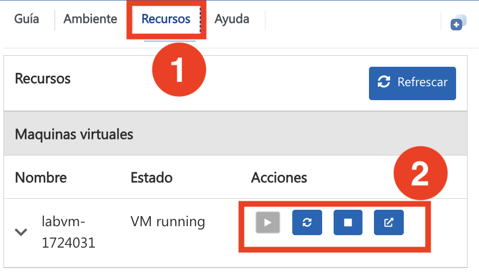

# Taller de Agentic AI Accelerator 

## Descripción general
Esta serie de talleres prácticos está diseñada para ayudarte a profundizar tus habilidades en el desarrollo impulsado por IA, automatización y la creación de aplicaciones inteligentes utilizando Microsoft Copilot Studio y los servicios de Azure AI. Cada día ofrece experiencias prácticas y guiadas: desde el diseño de agentes de IA hasta el despliegue de soluciones de IA a gran escala. Al finalizar este taller, tendrás experiencia práctica en la creación de soluciones escalables e inteligentes que mejoran el compromiso de los empleados, optimizan las operaciones empresariales y potencian la experiencia del cliente.

## Objetivos
- Aprender a diseñar y desplegar agentes de IA con Microsoft Copilot Studio y servicios de Azure AI.
- Obtener experiencia práctica en la orquestación multiagente usando Azure AI Agent Service SDK y Semantic Kernel.
- Construir aplicaciones personalizadas de Recuperación Aumentada de Generación (RAG) con Azure AI Foundry e integrar plugins de Semantic Kernel.
- Evaluar, ajustar y desplegar modelos de IA usando Prompt Flow para casos de uso reales.
- Construir sistemas inteligentes de escalamiento utilizando interfaces conversacionales, arquitectura orientada a eventos y flujos de trabajo potenciados por IA.

## Resumen día a día:

### Día 1: Construye agentes con Copilot Studio
Este laboratorio práctico te enseña cómo usar Microsoft 365 Copilot y Copilot Studio para mejorar la experiencia del empleado mediante creatividad y automatización impulsadas por IA. Crearás contenido visual, optimizarás transiciones de empleados, automatizarás la incorporación y pondrás en marcha sistemas de reconocimiento para aumentar el compromiso y la productividad.

### Día 2: Agentes de Azure AI
Este laboratorio práctico ofrece una introducción completa a la construcción de agentes de IA utilizando Azure AI Agent Service SDK y Semantic Kernel. Comenzarás creando agentes de IA con Azure AI Agent Service y aprovechando Semantic Kernel para orquestarlos en un sistema multiagente. A lo largo del laboratorio, explorarás técnicas para la colaboración, automatización y ejecución de tareas entre agentes. Al finalizar, tendrás experiencia práctica en el diseño, despliegue y gestión de agentes de IA para construir aplicaciones inteligentes, escalables y eficientes.

### Día 3: Desarrollo de una aplicación RAG personalizada usando Azure AI Foundry y exploración de Semantic Kernel
Este laboratorio práctico ofrece una introducción a la construcción de una aplicación personalizada de Recuperación Aumentada de Generación (RAG) usando Azure AI Foundry SDK. Comenzarás aprovisionando los recursos necesarios de Azure y configurando el entorno de AI Foundry. Después, implementarás un pipeline RAG de extremo a extremo que indexa y recupera datos relevantes para enriquecer las respuestas generadas por IA.
Como parte del laboratorio, también explorarás la integración de Semantic Kernel para crear interacciones dinámicas basadas en prompts e incorporar plugins útiles—como utilidades de tiempo y clima—para extender la funcionalidad de tu chatbot.
Al final de la sesión, tendrás experiencia práctica en la construcción de una solución RAG escalable que aprovecha el poder de Azure AI y el ecosistema de plugins de Semantic Kernel para una recuperación avanzada de conocimiento y generación inteligente de respuestas.

### Día 4: Desarrollo de aplicaciones de IA con Azure AI Foundry
Este laboratorio práctico está dirigido a desarrolladores de IA, científicos de datos, entusiastas de IA, ingenieros de la nube e ingenieros de IA que buscan mejorar sus habilidades en evaluación y ajuste de modelos usando Azure AI Foundry Prompt Flow. Los participantes obtendrán experiencia práctica en el desarrollo de modelos de IA personalizados, evaluando su rendimiento y refinándolos para mejores resultados. El laboratorio también aborda la integración de flujos conversacionales y herramientas esenciales, asegurando prácticas responsables de IA mediante medidas de seguridad de contenido.

## Comenzando con el laboratorio

Bienvenido a tu Taller de Azure Agentic AI. Comencemos para aprovechar al máximo esta experiencia:

## Acceso a tu entorno de laboratorio

Cuando estés listo para comenzar, tu máquina virtual y la **guía del laboratorio** estarán disponibles directamente en tu navegador web.

## Zoom de la guía del laboratorio

Para ajustar el nivel de zoom de la página del entorno, haz clic en el icono **A↕ : 100%** ubicado junto al temporizador en el entorno del laboratorio.

## Máquina virtual y guía del laboratorio

Tu máquina virtual será tu herramienta principal durante el taller. La guía del laboratorio es tu hoja de ruta hacia el éxito.

## Explorando tus recursos del laboratorio

Para comprender mejor tus recursos y credenciales del laboratorio, navega a la pestaña **Environment**.

## Uso de la función de ventana dividida

Para mayor comodidad, puedes abrir la guía del laboratorio en una ventana separada seleccionando el botón **Split Window** en la esquina superior derecha.

## Gestión de tu máquina virtual

Puedes **iniciar, detener o reiniciar (2)** tu máquina virtual según sea necesario desde la pestaña **Resources (1)**. ¡Tu experiencia está en tus manos!

> **Nota:** Asegúrate de que el script continúe ejecutándose y no se termine después de acceder al entorno.

## Comencemos con Azure Portal

1. En tu máquina virtual, haz clic en el icono de Azure Portal.
2. Verás la pestaña **Sign into Microsoft Azure**. Aquí, ingresa tus credenciales:

   - **Email/Username:** <inject key="AzureAdUserEmail"></inject>

     

3. Luego, proporciona tu contraseña:

   - **Password:** <inject key="AzureAdUserPassword"></inject>

     

4. Si aparece la ventana emergente **Action required**, haz clic en **Ask later**.
5. Si se te pregunta si deseas **stay signed in**, puedes hacer clic en **No**.
6. Si aparece la ventana emergente **Welcome to Microsoft Azure**, simplemente haz clic en **Cancel** para omitir el tour.

## Pasos para configurar MFA si no ves la opción "Ask Later"

1. En el mensaje **More information required**, selecciona **Next**.

1. En la página **Keep your account secure**, selecciona **Next** dos veces.

1. **Nota:** Si no tienes la aplicación Microsoft Authenticator instalada en tu dispositivo móvil:

   - Abre **Google Play Store** (Android) o **App Store** (iOS).
   - Busca **Microsoft Authenticator** y toca **Install**.
   - Abre la aplicación **Microsoft Authenticator**, selecciona **Add account** y luego elige **Work or school account**.

1. Se mostrará un **código QR** en la pantalla de tu computadora.

1. En la aplicación Authenticator, selecciona **Scan a QR code** y escanea el código mostrado en tu pantalla.

1. Después de escanear, haz clic en **Next** para continuar.

1. En tu teléfono, ingresa el número mostrado en la pantalla de tu computadora en la aplicación Authenticator y selecciona **Next**.
1. Si se te pregunta si deseas mantener la sesión iniciada, puedes hacer clic en "No".

1. Si aparece la ventana emergente **Welcome to Microsoft Azure**, simplemente haz clic en "Maybe Later" para omitir el tour.

## Contacto de soporte

El equipo de soporte de CloudLabs está disponible 24/7, los 365 días del año, por correo electrónico y chat en vivo para garantizar asistencia en cualquier momento. Ofrecemos canales de soporte dedicados tanto para estudiantes como para instructores, asegurando que todas tus necesidades sean atendidas de manera rápida y eficiente.

Contactos de soporte para estudiantes:

- Soporte por correo: [cloudlabs-support@spektrasystems.com](mailto:cloudlabs-support@spektrasystems.com)
- Soporte por chat en vivo: https://cloudlabs.ai/labs-support

Haz clic en **Next** en la esquina inferior derecha para comenzar tu experiencia en el laboratorio.

¡Ahora estás listo para explorar el poderoso mundo de la tecnología! No dudes en pedir ayuda si tienes preguntas durante el camino. ¡Disfruta tu taller!
