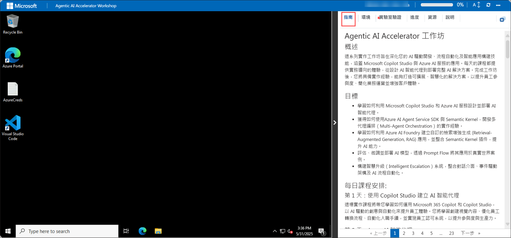

# Agentic AI Accelerator 工作坊

## 概述
這系列實作工作坊旨在深化您的 AI 驅動開發、流程自動化及智能應用構建技能，涵蓋 Microsoft Copilot Studio 與 Azure AI 服務的應用。每天的課程都提供實務導向的體驗，從設計 AI 智能代理到部署完整 AI 解決方案。完成工作坊後，您將具備實作經驗，能夠打造可擴展、智慧化的解決方案，以提升員工參與度、簡化業務運營並增強客戶體驗。

## 目標
- 學習如何利用 Microsoft Copilot Studio 和 Azure AI 服務設計並部署 AI 智能代理。
- 獲得如何使用Azure AI Agent Service SDK 與 Semantic Kernel，開發多代理編排（Multi-Agent Orchestration）的實作經驗。
- 學習如何利用 Azure AI Foundry 建立自訂的檢索增強生成 (Retrieval-Augmented Generation, RAG) 應用，並整合 Semantic Kernel 插件，提升 AI 能力。
- 評估、微調並部署 AI 模型，透過 Prompt Flow 將其應用於真實世界案例。
- 構建智慧升級（Intelligent Escalation）系統，整合對話介面、事件驅動架構及 AI 流程自動化。

## 每日課程安排:

### 第 1 天：使用 Copilot Studio 建立 AI 智能代理
這場實作課程將帶您學習如何運用 Microsoft 365 Copilot 和 Copilot Studio，以 AI 驅動的創意與自動化來提升員工體驗。您將學習創建視覺內容、優化員工轉換流程、自動化入職手續，並實施員工認可系統，以提升參與度與生產力。

### 第 2 天：Azure AI 智能代理
這場實作課程提供 Azure AI Agent Service SDK 與 Semantic Kernel 的全面介紹，讓您深入了解如何建立 AI 智能代理。您將從 Azure AI Agent Service 開始創建 AI 智能代理，並運用 Semantic Kernel 來編排多代理系統。在課程中，您將探索代理協作、流程自動化與任務執行的技術。課程結束後，您將具備設計、部署及管理 AI 智能代理的實作經驗，並能建立智慧化、可擴展且高效的 AI 驅動應用程式。

### 第 3 天：使用 Azure AI Foundry 開發自訂 RAG 應用程式並探索 Semantic Kernel
這場實作課程將帶您深入了解如何使用 Azure AI Foundry SDK 建立自訂的檢索增強生成（RAG）應用程式。您將從佈建所需的 Azure 資源開始，並配置 AI Foundry 環境。接著，您將實作端到端的 RAG 流程，該流程可索引並檢索相關數據，以強化 AI 生成的回應。在這堂課程中，您還將探索 Semantic Kernel 的整合應用，以創建動態、基於提示的互動，並加入各種有用的插件，例如時間和天氣工具，以擴展聊天機器人的功能。課程結束後，您將具備實作經驗，能夠構建可擴展的 RAG 解決方案，充分運用 Azure AI 和 Semantic Kernel 插件生態系統，以提升知識檢索能力和智慧化回應生成。

### 第 4 天：使用 Azure AI Foundry 開發 AI 應用程式
這場實作課程專為 AI 開發人員、數據科學家、AI 愛好者、雲端工程師及 AI 工程師設計，旨在提升學員如何使用 Azure AI Foundry Prompt Flow 進行模型評估與微調的能力。
學員將獲得開發自訂 AI 模型的實務經驗，學習如何評估其效能並加以調整，以獲得更優異的成果。課程還涵蓋了聊天流程（Chat Flow）和關鍵工具的整合，並確保 AI 應用符合負責任的 AI 原則，藉由內容安全機制來降低風險。

<!-- ### 第 5 天：智慧升級系統（Smart Escalation System）提升對話式支援
在這項挑戰中，您將使用基於 Chainlit 的應用程式，該應用程式運用 Dapr 的「發布-訂閱」訊息機制（Publish-Subscribe Messaging）來管理透過 AI 智能代理進行的客戶服務升級流程。
此解決方案整合 Azure 服務，包括 OpenAI、Cosmos DB 和 Service Bus，以提供智慧化且可擴展的互動。當 AI 智能代理無法解決使用者詢問時，系統將透過 Logic Apps 將問題升級至人工客服，並發送批准電子郵件，以進一步採取行動。
這場實作課程展示了如何將對話式介面、事件驅動架構（Event-Driven Architecture）以及 AI 驅動流程（AI-Powered Workflows）結合，從而提升客戶支援體驗。  -->

## 開始使用實驗室

歡迎來到 Agentic AI Accelerator 工作坊，讓我們充分利用這次學習機會吧:

## 存取您的實驗室環境

準備好開始後，您的虛擬機與 **實驗室指南** 將可在網頁瀏覽器中隨時存取。

## 調整實驗室指南的縮放比例

若需調整環境頁面的縮放級別，請點擊 **A↕ : 100%** 圖示，該圖示位於實驗室環境中的計時器旁邊。

## 虛擬機與實驗室指南

您的虛擬機將是整個工作坊的主要工具，而實驗室指南則是您成功的指引路徑。

## 探索您的實驗室資源

若要更深入了解您的實驗室資源與憑證資訊，請前往 **環境** 分頁進行檢視。

## 使用分割視窗功能

為了方便操作，您可以透過 **分割視窗** 按鈕，將實驗室指南開啟至獨立視窗，該按鈕位於頁面右上角。

## 管理您的虛擬機

您可以隨時在 **資源(1)** 分頁中 **啟動、停止或重新啟動（2）** 您的虛擬機，完全掌控您的學習體驗！

<!-- ## 延長實驗室時長

1. 若要延長實驗室的使用時間，請點擊 **沙漏（Hourglass）** 圖示，該圖示位於實驗室環境的右上角。

    

    >**注意：** 當實驗室剩餘時間僅 10 分鐘時，您才會看到 **沙漏** 圖示。

2. - 點擊 **OK** 以延長您的實驗室時間。

   

3. 若您未在實驗室即將結束前延長時長，系統將彈出提示視窗，讓您選擇是否延長。點擊 **OK** 以繼續。-->

> **注意：** 請確保腳本持續執行，並且在存取環境後未被終止。

## 開始使用 Azure Portal

1. 在您的虛擬機上，點擊 Azure Portal 圖示。

2. 您將看到 **登入 Microsoft Azure** 的頁面，在此輸入您的憑證資訊：

   - **電子郵件/使用者名稱:** <inject key="AzureAdUserEmail"></inject>

     

3. 接著，輸入您的密碼:

   - **密碼:** <inject key="AzureAdUserPassword"></inject>

     

4. 若出現 **需要採取動作** 的提示視窗，請點擊 **稍後再問**。
5. 若系統詢問是否 **保持登入**，您可以點擊 **否**。

   

6. 若出現 **歡迎使用 Microsoft Azure** 的彈出視窗，請點擊 **取消** 以跳過導覽。

## 如果"稍後再問"選項不可見，請按照以下步驟進行 MFA 設定

1. 在 **"需要更多資訊"** 提示畫面上，選擇 **下一步**。
2. 在 **"保持您的帳戶安全"** 頁面上，連續點擊 **下一步** 兩次。
3. **注意：** 如果您的行動裝置尚未安裝 Microsoft Authenticator 應用程式：
   - 打開 **Google Play Store**（Android） 或 **App Store**（iOS）。
   - 搜尋 **Microsoft Authenticator**，然後點擊 **安裝**。
   - 開啟 **Microsoft Authenticator** 應用程式，選擇 **新增帳戶**，再選擇 **公司或學校帳戶**。
4. 電腦螢幕上將顯示 **QR Code**。
5. 在 Microsoft Authenticator 應用程式中，選擇 **掃描 QR Code**，然後掃描螢幕上顯示的 QR Code。
6. 掃描完成後，點擊 **下一步** 繼續。
7. 在手機上，輸入電腦螢幕上顯示的數字，然後在 Microsoft Authenticator 應用程式中選擇 **下一步**。
8. 如果系統詢問是否**保持登入**，您可以選擇 **否**。
9. 如果出現 **歡迎使用 Microsoft Azure** 的提示視窗，請點擊 "稍後再說" 以跳過導覽。

## 支援聯絡方式
CloudLabs 支援團隊全年 24/7 提供服務，透過電子郵件和即時聊天，確保您隨時獲得順暢的協助。我們提供專屬支援管道，專為學習者和講師量身打造，以確保所有需求均能獲得快速且有效的解決方案。

學習者支援聯絡方式：
- 電子郵件支援： [cloudlabs-support@spektrasystems.com](mailto:cloudlabs-support@spektrasystems.com)
- 即時聊天支援： https://cloudlabs.ai/labs-support

點擊 右下角的**下一步**，開始您的實驗室學習旅程吧！

現在，您已準備好探索強大的科技世界！如果在過程中有任何問題，請隨時聯繫支援團隊。祝您學習愉快！
