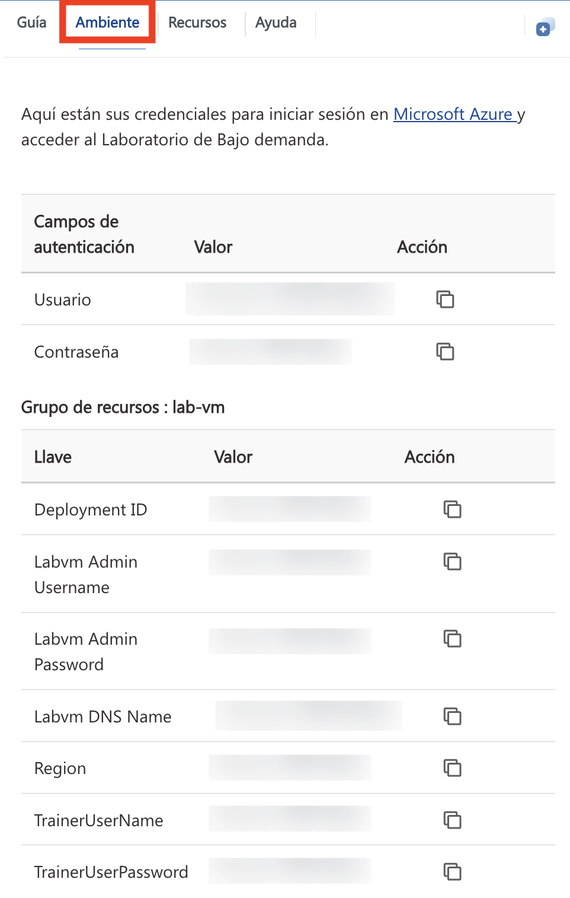
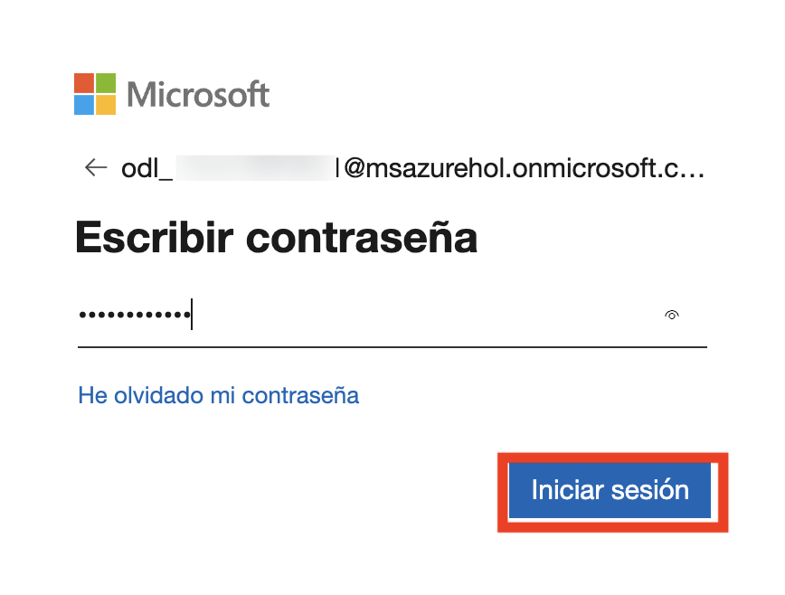

# Agentic AI アクセラレータワークショップ

## 概要
この実践的なワークショップシリーズでは、AIを活用した開発、オートメーション、インテリジェントアプリケーション構築のスキルを深めることを目的としています。Microsoft Copilot StudioやAzure AIサービスを活用しながら、AIエージェントの設計から本格的なAIソリューションの展開まで、実践的な体験を提供します。このワークショップを修了することで、従業員のエンゲージメント向上、業務の効率化、顧客体験の向上に貢献できるスケーラブルなインテリジェントソリューションを構築するスキルを身につけることができます。

## 目標
- Microsoft Copilot StudioとAzure AIサービスを使用してAIエージェントを設計・展開する方法を学ぶ
- Azure AI Agent Service SDKとSemantic Kernelを活用したマルチエージェントオーケストレーションを実践的に習得する
- Azure AI Foundryを活用してカスタムのRetrieval-Augmented Generation（RAG）アプリケーションを構築し、Semantic Kernelプラグインを統合する
- Prompt Flowを利用してAIモデルの評価、調整、展開を行い、実際のユースケースに対応できるようにする
- 会話型インターフェース、イベント駆動型アーキテクチャ、AI活用ワークフローを組み合わせたインテリジェントなエスカレーションシステムを構築する

## 日別スケジュール:

### 1日目: Copilot Studioでエージェントを構築
この実践的なラボでは、Microsoft 365 CopilotとCopilot Studioを活用し、AIを駆使した創造性とオートメーションによって従業員の体験を向上させる方法を学びます。視覚的なコンテンツを作成し、従業員の移行を円滑にし、オンボーディングを自動化し、評価システムを導入することで、エンゲージメントと生産性を向上させます。

### 2日目: Azure AIエージェント
この実践的なラボでは、Azure AI Agent Service SDKとSemantic Kernelを使用してAIエージェントを構築するための包括的な導入を提供します。まず、Azure AI Agent Serviceを活用してエージェントを作成し、Semantic Kernelを利用してマルチエージェントシステム内でオーケストレーションを行います。ラボを通じて、エージェントの協調、オートメーション、およびタスク実行の技術を探求します。この体験の終わりには、AIエージェントを設計、展開、管理する実践的なスキルを習得し、インテリジェントでスケーラブルかつ効率的なAI駆動アプリケーションを構築できるようになります。

### 3日目: Azure AI Foundryを活用したカスタムRAGアプリ開発とSemantic Kernelの探求
この実践的なラボでは、Azure AI Foundry SDKを活用してカスタムの **Retrieval-Augmented Generation (RAG)** アプリケーションを構築する方法を学びます。まず、必要なAzureリソースをプロビジョニングし、AI Foundry環境を設定するところから始めます。その後、AI生成の応答を強化するために、関連データのインデックス化と検索を行うエンドツーエンドのRAGパイプラインを実装します。
ラボでは、Semantic Kernelとの統合にも取り組み、動的なプロンプトベースのインタラクションを作成し、時間や天気のユーティリティなどの有用なプラグインを組み込んで、チャットボットの機能を拡張します。
このセッションの終わりには、Azure AIのパワーとSemantic Kernelプラグインエコシステムを活用した高度な知識検索とインテリジェントな応答生成が可能なスケーラブルなRAGソリューションの構築を実践的に習得できます。

### 4日目: Azure AI Foundryを活用したAIアプリケーション開発
この実践的なラボは、AI開発者、データサイエンティスト、AI愛好家、クラウドエンジニア、AIエンジニア向けに、Azure AI Foundry Prompt Flowを活用したモデル評価とファインチューニングのスキルを強化することを目的としています。参加者は、カスタムAIモデルの開発、パフォーマンス評価、改善プロセスを実践的に学ぶことができます。また、このラボでは、チャットフローや重要なツールの統合についても取り上げ、コンテンツの安全性を確保しながら、責任あるAI運用を実現するためのベストプラクティスを習得します。
このラボを通じて、より高度で洗練されたAIソリューションを構築するためのスキルを実践的に身につけることができるでしょう。

<!-- ### 5日目: 会話型サポートのためのスマートエスカレーションシステム
​この課題では、Chainlitベースのアプリケーションを活用し、Daprのパブリッシュ-サブスクライブメッセージングを用いてAIエージェントによるカスタマーサービスのエスカレーションを管理します。このソリューションは、Azureサービス（OpenAI、Cosmos DB、Service Bus）を統合し、インテリジェントでスケーラブルな対話を提供します。AIエージェントがユーザーの問い合わせを解決できない場合、Logic Appsを介して問題が人間のエージェントへエスカレーションされ、承認メールが送信されることで対応が進みます。この実践的なワークショップでは、会話型インターフェース、イベント駆動型アーキテクチャ、AIを活用したワークフローを組み合わせることで、カスタマーサポートを強化する方法を学びます。  -->

## ラボの開始方法

Azure Agentic AIワークショップへようこそ！この体験を最大限に活用していきましょう。

## ラボ環境へのアクセス

準備が整ったら、**仮想マシン**と**ガイド**がウェブブラウザ内で利用可能になります。

## ラボガイドのズームイン/ズームアウト

ズームレベルを調整するには、**A↕ : 100%** アイコンをクリックしてください。これは、ラボ環境のタイマーの横にあります。

## 仮想マシンとラボガイド

ワークショップ中、仮想マシンは作業の中心となります。一方、ラボガイドは成功への道しるべです。

## ラボリソースの探索

ラボリソースと認証情報の詳細を確認するには、**環境**タブを開いてください。

## ウィンドウの分割機能の活用

利便性を向上させるために、**ウィンドウの分割** ボタンを右上のコーナーから選択すると、ラボガイドを別のウィンドウで開くことができます。

## 仮想マシンの管理

**リソース**タブ (1) から仮想マシンを**起動、停止、または再起動 (2)** することができます。体験を自由にカスタマイズしてください！

<!-- ## ラボの時間延長

1. ラボの時間を延長するには、ラボ環境の右上にある **砂時計** アイコンをクリックしてください。

    

    >**注意:** ラボの終了まで残り **10分** になると、**砂時計** アイコンが表示されます。

2. 時間を延長するには、**OK** をクリックしてください。

   

3. ラボの終了間際に時間を延長していない場合、ポップアップが表示され、延長の選択肢が提示されます。その際も **OK** をクリックして進めてください。 -->

> **注意:** 環境にアクセスした後もスクリプトが実行され続けるようにし、途中で終了しないようご確認ください。

## Azureポータルの開始方法

1. 仮想マシン上で、Azure Portalのアイコンをクリックします。
2. **Microsoft Azureにサインイン**のタブが表示されるので、そこで資格情報を入力してください。

   - **メール/ユーザー名:** <inject key="AzureAdUserEmail"></inject>

     

3. 次に、パスワードを入力します。

   - **パスワード:** <inject key="AzureAdUserPassword"></inject>

     

4. **サインインの状態を維持しますか?** と尋ねられた場合は、**いいえ** をクリックできます。
5. **アクションが必要**のポップアップウィンドウが表示された場合は、**後で確認**をクリックしてください。
6. **Microsoft Azureへようこそ**のポップアップウィンドウが表示された場合は、ツアーをスキップするために**キャンセル**をクリックしてください。

## 「後で確認」オプションが表示されない場合のMFA設定手順

1. - **追加情報が必要**の画面で、**次へ**を選択します。
2. - **アカウントの安全を守る**ページで、**次へ**を2回クリックします。

3. **注意:** 「Microsoft Authenticator」アプリがスマートフォンにインストールされていない場合:

   - **Google Play ストア**（Android）または **App Store**（iOS）を開きます。
   - **Microsoft Authenticator**を検索し、**インストール**をタップします。
   - **Microsoft Authenticator**アプリを開き、**アカウントを追加**を選択し、**職場または学校のアカウント**を選択します。

4. **QRコード**がパソコンの画面に表示されます。
5. Authenticatorアプリで **QRコードをスキャン**を選択し、画面に表示されたコードをスキャンします。
6. スキャン後、**次へ**をクリックして続行します。
7. スマートフォンのAuthenticatorアプリで、パソコンの画面に表示された番号を入力し、**次へ**を選択します。
8. **サインインの状態を維持しますか?** と尋ねられた場合は、**いいえ**をクリックできます。
9. **Microsoft Azureへようこそ**のポップアップウィンドウが表示された場合は、ツアーをスキップするために**キャンセル**をクリックしてください。

## サポート連絡先

CloudLabsのサポートチームは、24時間365日対応しており、メールおよびライブチャットを通じてシームレスなサポートを提供します。学習者と講師の両方に特化した専用のサポートチャネルを提供し、あらゆるニーズに迅速かつ効率的に対応します。

学習者向けサポート連絡先:

- メールサポート: [cloudlabs-support@spektrasystems.com](mailto:cloudlabs-support@spektrasystems.com)
- ライブチャットサポート: https://cloudlabs.ai/labs-support

画面右下の **次へ**をクリックすると、ラボの旅が始まります！

これで、テクノロジーの世界を探求する準備が整いました。質問があれば遠慮なくお問い合わせください。ワークショップを楽しんでくださいね！
