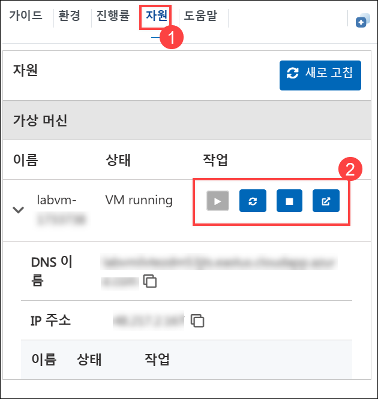

# Agentic AI Accelerator 워크숍

## 개요
이 실습 중심의 워크숍 시리즈는 Microsoft Copilot Studio와 Azure AI 서비스를 활용하여 AI 기반 개발, 자동화, 그리고 지능형 애플리케이션 구축에 대한 역량을 심화하는 데 목적이 있습니다. 매일 진행되는 실습 과정을 통해 AI 에이전트의 설계부터 대규모 AI 솔루션 배포에 이르기까지 실용적이고 체계적인 축적된 내용을 배우게 됩니다. 이 워크숍을 마치면, 여러분은 직원들의 참여도를 높이고, 비즈니스 운영을 간소화하며, 고객 경험을 향상시킬 수 있는 확장 가능하고 지능적인 솔루션을 실제로 구축하는 데 필요한 실전 역량을 갖추게 됩니다.

## 목표
- Microsoft Copilot Studio와 Azure AI 서비스를 활용하여 AI 에이전트를 설계하고 배포하는 방법을 학습합니다.
- Azure AI Agent Service SDK와 Semantic Kernel을 사용하여 멀티 에이전트 오케스트레이션(multi-agent orchestration)을 실습합니다.
- Azure AI Foundry를 활용해 맞춤형 RAG(Retrieval-Augmented Generation) 애플리케이션을 구축하고, Semantic Kernel 플러그인을 통합합니다.
- Prompt Flow를 사용하여 실제 사례 기반으로 AI 모델을 평가(Evaluate), 미세 조정(finetune), 배포(deploy)하는 방법을 익힙니다.
<!-- - 대화형 인터페이스, 이벤트 기반 아키텍처, AI 기반 워크플로우를 활용해 지능형 업무 이관(Escalation) 시스템을 구성합니다. -->

## 일자별 구성

### 1일차: Copilot Studio로 에이전트 구축
이번 실습에서는 Microsoft 365 Copilot과 Copilot Studio를 활용하여 AI 기반의 창의성과 자동화를 통해 직원 경험을 향상시키는 방법을 학습합니다. 시각적 콘텐츠를 생성하고, 직원 전환 과정을 간소화하며, 온보딩 프로세스를 자동화하고, 직원 인식 시스템을 구현하여 참여도와 생산성을 높이는 작업을 수행하게 됩니다.

### 2일차: Azure AI Agent
이번 실습에서는 Azure AI Agent Service SDK와 Semantic Kernel을 활용한 AI 에이전트를 구축하는 방법에 대하여 포괄적인 개요를 제공합니다. Azure AI Agent Service로 에이전트를 생성하고, Semantic Kernel을 사용하여 멀티 에이전트 시스템 내에서 이를 오케스트레이션하는 과정을 학습합니다. 에이전트 간 협업, 자동화, 태스크 실행 기법을 실습하며, 지능적이고 확장 가능한 AI 애플리케이션을 설계, 배포, 관리하는 데 필요한 실전 역량을 쌓게 됩니다.

### 3일차: Azure AI Foundry를 활용한 맞춤형 RAG 애플리케이션 개발 및 Semantic Kernel 탐색
이번 실습에서는 Azure AI Foundry SDK를 활용하여 맞춤형 RAG(Retrieval-Augmented Generation) 애플리케이션을 구축하는 실용적인 방법을 배웁니다. 필요한 Azure 리소스를 프로비저닝하고 AI Foundry 환경을 구성한 후, 관련 데이터를 인덱싱하고 검색하여 AI 응답을 보강하는 엔드투엔드 RAG 파이프라인을 구현합니다.
또한 Semantic Kernel을 통합하여 동적 프롬프트 기반 상호작용을 구성하고, 시간 및 날씨 유틸리티와 같은 유용한 플러그인을 챗봇 기능에 통합하는 방법도 실습합니다.
이 실습 과정을 통해서 Azure AI와 Semantic Kernel 플러그인 생태계를 활용하여 확장 가능하고 지능적인 RAG 솔루션을 구축하는 실전 경험을 얻게 됩니다.

### 4일차: Azure AI Foundry를 활용한 AI 애플리케이션 개발
이번 실습은 모델 평가(Evaluation) 및 미세 조정(fine-tuning)을 수행할 때 필요한 역량을 향상시키고 싶은 AI 개발자, 데이터 과학자, AI 엔지니어 및 클라우드 엔지니어를 대상으로 합니다. 참가자는 Azure AI Foundry의 Prompt Flow를 활용하여 사용자 정의 AI 모델을 개발하고, 그 성능을 평가하며, 결과를 개선하기 위한 조정 과정을 실습하게 됩니다.
또한 챗 플로우(chat flow)와 필수 도구의 통합 방법, 콘텐츠 안전 조치를 통한 책임 있는 AI 구현 방안에 대해서도 다룹니다.

<!-- ### 5일차: 대화형 지원을 위한 스마트 업무 이관(Escalation) 시스템
이번 도전과제는 Chainlit 기반 애플리케이션을 활용하여, Dapr의 발행-구독(pub/sub) 메시징을 통해 고객 서비스 이슈를 AI 에이전트를 이용해 관리하는 방법을 실습합니다. 이 솔루션은 Azure OpenAI, Cosmos DB, Service Bus 등 다양한 Azure 서비스를 통합하여 지능적이고 확장 가능한 상호작용을 제공합니다.
AI 에이전트가 사용자 문의를 해결하지 못할 경우, 시스템은 Logic Apps를 통해 이슈를 사람 상담원에게 업무를 이관하며, 추가 조치를 위한 승인 이메일을 전송합니다.이번 실습을 통해 대화형 인터페이스, 이벤트 기반 아키텍처, 그리고 AI 기반 워크플로우를 결합하여 고객 지원을 향상시키는 방법을 체험하게 됩니다. -->

## 실습 시작하기

Agentic AI Accelerator 워크숍에 오신 것을 환영합니다. 이번 워크숍을 통해 소중한한 경험을 얻으시길 기원하며 본격적으로 시작해 보겠습니다. 

## 실습 환경 접속

랩 환경에 접속하면 웹 브라우저 내에서 **가상 머신**과 **가이드**를 사용할 수 있습니다.

## 실습 가이드 확대/축소

실습 환경을 확대하거나 축소하려면, 실습 환경 타이머 옆에 있는 **A↕** 아이콘을 클릭하세요.

## 가상 머신과 실습 가이드

가상 머신은 워크숍 내내 사용하는 작업 도구이며, 실습 가이드는 성공을 위한 로드맵입니다.

## 실습 리소스 살펴보기

**환경** 탭을 이용하면 실습 리소스와 자격 증명에 대한 정보를 자세히 살펴볼 수 있습니다. 

## 창 분할 기능 활용하기

오른쪽 상단에 있는 **창 분할** 버튼을 클릭하면 실습 가이드를 별도의 창에서 열 수 있어 편리합니다.

   

## 가상 머신 관리하기

**자원 (1)** 탭을 이용하면 가상 머신을 자유롭게 **시작, 중지 또는 다시 시작(2)** 하실 수 있습니다. 여러분이 원하는대로 작업할 수 있습니다!

<!-- ## 실습 시간 연장하기

1. 실습 환경의 오른쪽 상단에 있는 **모래시계** 아이콘을 클릭하면 실습 시간을 연장할 수 있습니다.

    

    >**참고**: 실습 종료 10분 전이 되어야 **모래시계** 아이콘이 나타납니다.

1. 실습 시간을 연장하려면 **확인** 버튼을 클릭하세요.

   

1. 만약 실습 종료 직전까지 시간을 연장하지 않은 경우, 팝업 창이 나타나며 연장 옵션을 제공합니다. 이때도 **확인** 버튼을 눌러 진행하시면 됩니다. -->

> **참고:** 실습 환경에 접속한 직후에는 스크립트가 중단되지 않고 계속 실행 될 수 있도록 가상 머신을 유지해 주세요.

## Auzre 포털 시작하기

1. 가상 머신에서 **Azure Portal** 아이콘을 클릭합니다.

1. **Microsoft Azure에 로그인** 탭이 열리면, 아래의 자격 증명을 입력합니다:

   - **Email/Username:** <inject key="AzureAdUserEmail"></inject>

      

1. 다음으로 비밀번호를 입력합니다.

   - **Password:** <inject key="AzureAdUserPassword"></inject>

     

1. **작업 필요** 팝업 창이 나타나면 **나중에 묻기** 를 클릭합니다.

1. **Microsoft Azure에 오신 것을 환영합니다** 라는 팝업이 나타나면, **취소**를 클릭하여 투어를 생략합니다.`

## **나중에 묻기** 옵션이 보이지 않을 때, 다단계 인증(MFA) 설정을 계속 진행하는 방법

1. "추가 정보가 필요합니다" 메시지가 표시되면, **다음**을 클릭합니다.

1. "계정을 더 안전하게 보호하세요" 페이지가 나타나면, **다음**을 두 번 클릭합니다.

1. **참고:** 휴대폰에 Microsoft Authenticator 앱이 설치되어 있지 않다면 아래 단계를 따르세요:
   - **Play 스토어**(Android)나 **App Store(iOS)**를 엽니다.
   - **Microsoft Authenticator**를 검색하여 **설치**를 선택합니다.
   - **Microsoft Authenticator** 앱을 열고, **계정 추가** 선택 후, **회사 또는 학교 계정**을 선택합니다.

1. 컴퓨터 화면에서 **QR 코드**가 표시됩니다.

1. **Microsoft Authenticator** 앱 내에서, **QR 코드 스캔**을 선택하고, 화면에 표시된 QR 코드를 스캔합니다.

1. 스캔이 완료되면, 컴퓨터에서 **다음**을 선택하여 진행합니다.

1. 휴대폰에서 컴퓨터 화면에 표시된 숫자를 입력하고 **다음**을 선택합니다.

1. "로그인을 유지하시겠습니까?" 메시지가 뜨면, **아니오**를 클릭해도 무방합니다.

1. **Microsoft Azure에 오신 것을 환영합니다** 창이 팝업되면, **나중에 묻기**를 클릭하여 투어를 건너뜁니다.

## 지원 문의처

CloudLabs 지원팀은 연중무휴 24시간 이메일 및 실시간 채팅을 통해 언제든지 원활한 지원을 제공합니다. 학습자와 강사를 위한 전용 지원 채널을 운영하여, 각 사용자에 맞춤화된 신속하고 효율적인 지원을 보장합니다.

학습자 지원 문의처:

- 이메일 지원: [cloudlabs-support@spektrasystems.com](mailto:cloudlabs-support@spektrasystems.com)
- 실시간 채팅 지원: https://cloudlabs.ai/labs-support

오른쪽 하단에 있는 **다음** 버튼을 클릭하여 실습을 시작하세요!

이제 강력한 기술의 세계를 탐험할 준비가 모두 완료되었습니다. 진행 중 궁금한 점이 있다면 언제든지 문의해 주세요. 즐거운 워크숍이 되시기 바랍니다!

