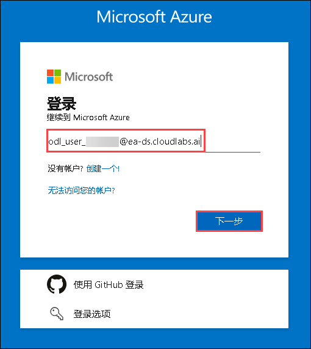

# Agentic AI Accelerator 研讨会

## 概述
本实践研讨会系列旨在帮助您深入掌握使用 Microsoft Copilot Studio 和 Azure AI 服务进行 AI 驱动开发、自动化和构建智能应用程序的技能。每天都提供实践指导体验—从设计 AI 代理到部署全面的 AI 解决方案。在研讨会结束时，您将获得创建可扩展、智能解决方案的实践经验，这些解决方案可以提升员工参与度、简化业务运营并改善客户体验。

## 目标
- 学习使用 Microsoft Copilot Studio 和 Azure AI 服务设计和部署 AI 代理
- 获得使用 Azure AI Agent Service SDK 和 Semantic Kernel 进行多代理编排的实践经验
- 使用 Azure AI Foundry 构建自定义检索增强生成 (RAG) 应用程序并集成 Semantic Kernel 插件
- 使用 Prompt Flow 评估、微调和部署 AI 模型以应对实际用例
- 使用会话界面、事件驱动架构和 AI 驱动的工作流构建智能升级系统

## 每日课程详解：

### 第一天：使用 Copilot Studio 构建代理
本实践实验将教您如何使用 Microsoft 365 Copilot 和 Copilot Studio 通过 AI 驱动的创造力和自动化来改善员工体验。您将创建视觉内容、简化员工转换、自动化入职流程，并实施认可系统以提高参与度和生产力。

### 第二天：Azure AI 代理
本实践实验提供使用 Azure AI Agent Service SDK 和 Semantic Kernel 构建 AI 代理的全面介绍。您将从使用 Azure AI Agent Service 创建 AI 代理开始，并利用 Semantic Kernel 在多代理系统中进行编排。在整个实验过程中，您将探索代理协作、自动化和任务执行的技术。到实验结束时，您将获得设计、部署和管理 AI 代理的实践经验，以构建智能、可扩展和高效的 AI 驱动应用程序。

### 第三天：使用 Azure AI Foundry 开发自定义 RAG 应用程序并探索 Semantic Kernel
本实践实验提供使用 Azure AI Foundry SDK 构建自定义检索增强生成 (RAG) 应用程序的实践介绍。您将从配置必要的 Azure 资源和设置 AI Foundry 环境开始。之后，您将实现端到端的 RAG 管道，该管道索引并检索相关数据以丰富 AI 生成的响应。
作为实验的一部分，您还将探索 Semantic Kernel 的集成，以创建动态的、基于提示的交互，并整合有用的插件（如时间和天气实用工具）以扩展聊天机器人的功能。
到课程结束时，您将获得构建可扩展 RAG 解决方案的实践经验，该解决方案利用 Azure AI 和 Semantic Kernel 插件生态系统的力量进行高级知识检索和智能响应生成。

### 第四天：使用 Azure AI Foundry 开发 AI 应用程序
本实践实验面向 AI 开发人员、数据科学家、AI 爱好者、云工程师、AI 工程师，旨在提升他们使用 Azure AI Foundry Prompt Flow 进行模型评估和微调的技能。参与者将获得开发自定义 AI 模型、评估其性能和改进结果的实践经验。该实验还涉及聊天流程和基本工具的集成，通过内容安全措施确保负责任的 AI 实践。

<!-- ### 第五天：用于会话式支持的智能升级系统
在本挑战中，您将使用基于 Chainlit 的应用程序，该程序通过 Dapr 的发布-订阅消息机制，管理客户服务中的 AI 代理升级流程。该解决方案集成了多个 Azure 服务，包括 OpenAI、Cosmos DB 和 Service Bus，以实现智能化和可扩展的客户互动。当 AI 代理无法解决用户问题时，系统会通过 Logic Apps 将问题升级至人工客服，并发送审批邮件以便进一步处理。

本实践活动展示了如何将会话式界面、事件驱动架构和 AI 流程自动化有机结合，从而提升客户支持效率与体验。  -->

## 实验入门

欢迎来到 Azure Agentic AI 研讨会，让我们开始充分利用这次体验：

## 访问您的实验环境

当您准备好开始时，您的虚拟机和**实验指南**将在您的网络浏览器中触手可及。

## 实验指南缩放

要调整环境页面的缩放级别，请点击实验环境中计时器旁边的 **A↕ : 100%** 图标。

## 虚拟机和实验指南

您的虚拟机是贯穿研讨会的工作平台。实验指南是您成功的路线图。

## 探索您的实验资源

要更好地了解您的实验资源和凭据，请导航到**环境**标签页。

## 使用分屏功能

为了方便起见，您可以通过选择右上角的**分屏**按钮在单独的窗口中打开实验指南。

## 管理您的虚拟机

您可以根据需要从**资源** 标签页**启动、停止或重启** 您的虚拟机。您可以完全掌控您的体验！

## 让我们开始使用 Azure 门户

1. 在您的虚拟机上，点击 Azure 门户图标。
2. 您将看到**登录 Microsoft Azure** 标签页。在此输入您的凭据：

   - **电子邮件/用户名：** <inject key="AzureAdUserEmail"></inject>

     

3. 接下来，提供您的密码：

   - **密码：** <inject key="AzureAdUserPassword"></inject>

     

4. 如果出现**需要操作**弹出窗口，请点击**稍后询问**。
5. 如果提示**保持登录状态**，您可以点击**否**。

   

6. 如果出现**欢迎使用 Microsoft Azure** 弹出窗口，只需点击**"取消"**跳过导览。

   

## 如果没有"稍后询问"选项，请按以下步骤设置 MFA

1. 在"需要更多信息"**提示下，选择**下一步。

1. 在"保护您的帐户"**页面上，连续选择两次**下一步。

1. **注意：** 如果您的移动设备上未安装 Microsoft Authenticator 应用：

   - 打开 **Google Play 商店**（Android）或 **App Store**（iOS）
   - 搜索 **Microsoft Authenticator** 并点击**安装**
   - 打开 **Microsoft Authenticator** 应用，选择**添加帐户**，然后选择**工作或学校帐户**

1. 您的计算机屏幕上将显示一个 **QR 码**。

1. 在 Authenticator 应用中，选择**扫描 QR 码**并扫描屏幕上显示的代码。

1. 扫描后，点击**下一步**继续。

1. 在您的手机上，在 Authenticator 应用中输入计算机屏幕上显示的数字并选择**下一步**。
1. 如果提示保持登录状态，您可以点击"否"。

1. 如果出现**欢迎使用 Microsoft Azure**弹出窗口，只需点击"稍后再说"跳过导览。

## 支持联系方式

CloudLabs 支持团队全年无休（24/7、365天）通过电子邮件和在线聊天提供服务，确保随时提供无缝协助。我们为学员和讲师提供专门的支持渠道，确保所有需求都能得到及时有效的解决。

学员支持联系方式：

- 电子邮件支持：[cloudlabs-support@spektrasystems.com](mailto:cloudlabs-support@spektrasystems.com)
- 在线聊天支持：https://cloudlabs.ai/labs-support

点击右下角的**下一步**开始您的实验之旅！

如果您在途中有任何问题，请随时联系我们。祝您学习愉快！ 
